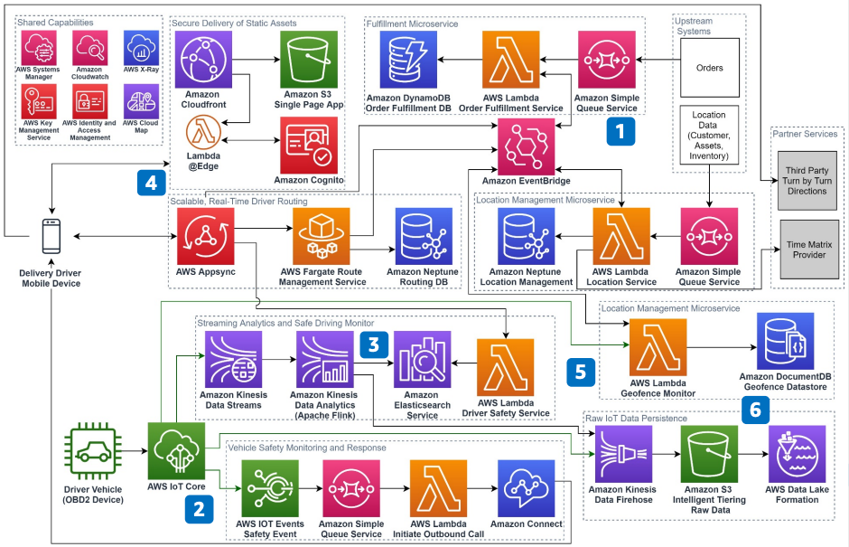

# Last Mile Delivery

Publication date: **October 7, 2020 ([Diagram history](#lmd-history "#lmd-history"))**

With this architecture, you can optimize your last mile delivery operations. Improve asset
utilization and reduce operational costs by eliminating data silos. Analyze data in real time
and disseminate alerts across your fleet. The solution uses [AWS IoT Core](../../../iot/latest/developerguide.md "../../../iot/latest/developerguide.md") for vehicle connectivity, [AWS Fargate](../../../AmazonECS/latest/userguide/what-is-fargate.md "../../../AmazonECS/latest/userguide/what-is-fargate.md")
for route calculation, and [Amazon Neptune](../../../neptune/latest/userguide.md "../../../neptune/latest/userguide.md") for graph-based routing.

## Last mile delivery diagram

The following steps describe the data flow and delivery components for this
architecture:

1. Decouple upstream dependencies with an event-based microservices architecture. Ingest
   order and location data to increase business agility and lower costs.
2. Ingest vehicle data in real time through the OBD2 interface and AWS IoT Core. Monitor
   vehicle status continuously for safety by using [AWS IoT Events](../../../iotevents/latest/developerguide.md "../../../iotevents/latest/developerguide.md"). Automate outbound calls to
   drivers and maintenance crews with [Connect Customer](../../../connect/latest/adminguide.md "../../../connect/latest/adminguide.md").
3. Implement a streaming Internet of Things (IoT) extract, transform, and load (ETL)
   pipeline without managing infrastructure. Update safe driving scorecards in near real
   time. Improve safety and reduce claims liability.
4. Create a scalable, real-time mobile fulfillment application for drivers by using
   AWS AppSync. Protect front-end assets with [Amazon Cognito](../../../cognito/latest/developerguide.md "../../../cognito/latest/developerguide.md"). Calculate optimal driving
   routes with AWS Fargate and Amazon Neptune.
5. Use [Amazon DocumentDB](../../../documentdb/latest/developerguide.md "../../../documentdb/latest/developerguide.md") to track when drivers arrive
   at the next stop. Increase the accuracy of estimated time of arrival (ETA)
   communications.
6. Persist IoT data from vehicles at scale by using [Amazon Data Firehose](../../../firehose/latest/dev.md "../../../firehose/latest/dev.md") and [Amazon S3](../../../AmazonS3/latest/userguide.md "../../../AmazonS3/latest/userguide.md") Intelligent-Tiering. Use [AWS Lake Formation](../../../lake-formation/latest/dg.md "../../../lake-formation/latest/dg.md") to set up a data
   lake as the single source of truth for BI and analytics.

## Further reading

For additional information, see the following resources:

- [AWS Architecture Icons](https://aws.amazon.com/architecture/icons "https://aws.amazon.com/architecture/icons")
- [AWS Architecture Center](https://aws.amazon.com/architecture/ "https://aws.amazon.com/architecture/")
- [AWS
  Well-Architected](https://aws.amazon.com/architecture/well-architected "https://aws.amazon.com/architecture/well-architected")

## Diagram history

To receive updates about this reference architecture diagram, subscribe to the RSS
feed.

| Change              | Description                                     | Date            |
| ------------------- | ----------------------------------------------- | --------------- |
| Initial publication | Reference architecture diagram first published. | October 7, 2020 |

###### RSS subscription requirement

To subscribe to RSS updates, you must have an RSS plugin enabled for the browser you are
using.
