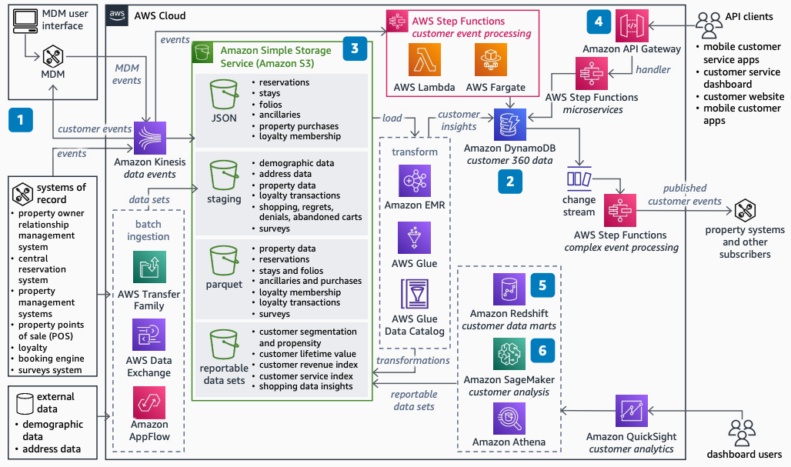

# Lodging Data Platform with Master Data Management

Publication date: **October 7, 2022 ([Diagram history](#ldpmdm-history "#ldpmdm-history"))**

With this architecture, you can enhance the lodging data platform with MDM tools. Identify
unique travelers and deduplicate loyalty membership records. Use the ML Transform feature in
[AWS Glue](../../../glue/latest/dg.md "../../../glue/latest/dg.md") to identify duplicate
customers. Build a single view of each customer that extends beyond loyalty members.

## Lodging data platform with MDM diagram

The following steps describe the architecture:

1. Augment the single view of customer data as a service by using an MDM tool. Create a
   unified customer record. Use the ML Transform feature in AWS Glue to identify duplicates in
   loyalty membership and customers who have not signed up for loyalty.
2. Adapt the operations data stores, data lakes, and analytics platforms to new customer
   data feeds. Deliver new capabilities as new versions of customer-centric microservices
   and events.
3. Enhance the data lake by changing to a customer-centric view for lifetime value,
   revenue index, and service index.
4. Add new microservices to consume and publish the new customer-centric services by
   using [AWS Step Functions](../../../step-functions/latest/dg.md "../../../step-functions/latest/dg.md") and [AWS Lambda](../../../lambda/latest/dg.md "../../../lambda/latest/dg.md").
5. Augment the enterprise data warehouse (EDW) with new customer-centric domain schemas
   and data marts in [Amazon Redshift](../../../redshift/latest/mgmt.md "../../../redshift/latest/mgmt.md").
6. Use existing raw and curated data and new customer data to build new models in [Amazon SageMaker AI](../../../sagemaker/latest/dg.md "../../../sagemaker/latest/dg.md").

## Further reading

For additional information, see the following resources:

- [AWS Architecture Icons](https://aws.amazon.com/architecture/icons "https://aws.amazon.com/architecture/icons")
- [AWS Architecture Center](https://aws.amazon.com/architecture/ "https://aws.amazon.com/architecture/")
- [AWS Well-Architected](https://aws.amazon.com/architecture/well-architected "https://aws.amazon.com/architecture/well-architected")

## Diagram history

To receive updates about this reference architecture diagram, subscribe to the RSS
feed.

| Change              | Description                                     | Date            |
| ------------------- | ----------------------------------------------- | --------------- |
| Initial publication | Reference architecture diagram first published. | October 7, 2022 |

###### RSS subscription requirement

To subscribe to RSS updates, you must have an RSS plugin enabled for the browser you
are using.
