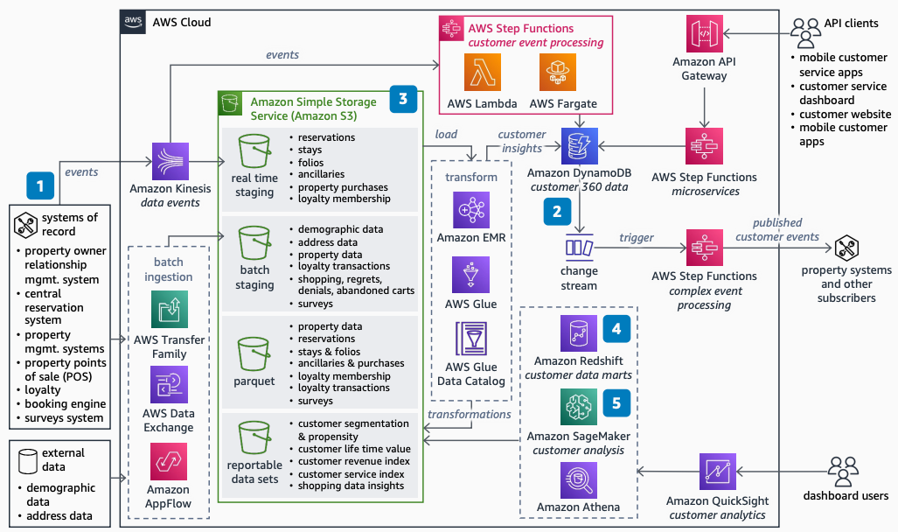

# Lodging Data Platform

Publication date: **October 7, 2022 ([Diagram history](#ldp-history "#ldp-history"))**

With this architecture, you can build a data platform that serves both operational and
analytics needs for lodging companies. Use open data standards and separate storage from
compute. You use [Amazon Simple Storage Service](../../../AmazonS3/latest/userguide.md "../../../AmazonS3/latest/userguide.md") for the data lake, [Amazon DynamoDB](../../../amazondynamodb/latest/developerguide.md "../../../amazondynamodb/latest/developerguide.md") for operational data, and
[Amazon SageMaker AI](../../../sagemaker/latest/dg.md "../../../sagemaker/latest/dg.md") for artificial
intelligence (AI) and machine learning (ML) models.

## Lodging data platform diagram

The following steps describe the architecture:

1. Build basic data as a service with the most important domains: properties,
   reservations, stays, and loyalty. Separate storage from compute as a key design
   tenet.
2. Use purpose-built databases and serverless architecture to deliver microservices and
   events for the operational data store. Use DynamoDB, [AWS Lambda](../../../lambda/latest/dg.md "../../../lambda/latest/dg.md"), and [AWS Step Functions](../../../step-functions/latest/dg.md "../../../step-functions/latest/dg.md") to scale based on adoption. Replace
   expensive on-premises operational databases and service-oriented architecture (SOA)
   infrastructure.
3. Use open standards to build the data lake with the same data as the operational
   platform. Use a read pattern schema to make raw and curated data available for all user
   roles. Process data by using [AWS Glue](../../../glue/latest/dg.md "../../../glue/latest/dg.md") and [Amazon EMR](../../../emr/latest/ManagementGuide.md "../../../emr/latest/ManagementGuide.md").
4. Build standard enterprise data warehouse schemas and data marts in [Amazon Redshift](../../../redshift/latest/mgmt.md "../../../redshift/latest/mgmt.md") for known usage
   patterns. For one-time requirements, publish the data catalog and use [Amazon Athena](../../../athena/latest/ug.md "../../../athena/latest/ug.md") for analysis directly
   from the data lake.
5. Use SageMaker AI to provide standard AI and ML models for customer segmentation and lifetime
   value. Build custom models on top of the data.

## Further reading

For additional information, see the following resources:

- [AWS Architecture Icons](https://aws.amazon.com/architecture/icons "https://aws.amazon.com/architecture/icons")
- [AWS Architecture Center](https://aws.amazon.com/architecture/ "https://aws.amazon.com/architecture/")
- [AWS Well-Architected](https://aws.amazon.com/architecture/well-architected "https://aws.amazon.com/architecture/well-architected")

## Diagram history

To receive updates about this reference architecture diagram, subscribe to the RSS
feed.

| Change              | Description                                     | Date            |
| ------------------- | ----------------------------------------------- | --------------- |
| Initial publication | Reference architecture diagram first published. | October 7, 2022 |

###### RSS subscription requirement

To subscribe to RSS updates, you must have an RSS plugin enabled for the browser you
are using.
