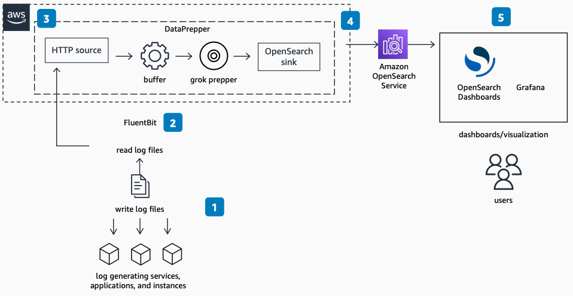

# Log Analytics with Open Source Patterns

Publication date: **December 13, 2022 ([Diagram history](#diagram-history "#diagram-history"))**

This architecture uses FluentBit and Data Prepper to collect, aggregate, and transform logs into OpenSearch.

## Log Analytics with Open Source Patterns

1. The application, container system, and associated services generate logs. These include Docker containers, Kubernetes pods, [Amazon Elastic Compute Cloud](../../../AWSEC2/latest/UserGuide/concepts.md "../../../AWSEC2/latest/UserGuide/concepts.md") instances, Elastic Load Balancer logs, [AWS Lambda](../../../lambda/latest/dg/welcome.md "../../../lambda/latest/dg/welcome.md"), and relational database systems.
2. FluentBit, a popular Apache-licensed log forwarder, reads the log files and forwards them to Data Prepper over HTTP.
3. Data Prepper is a server-side data collector. It filters, enriches, transforms, normalizes, and aggregates data for downstream analytics. Data Prepper receives the logs, buffers them, then optionally structures the data through a grok prepper.
4. Data Prepper creates the service map and assembles the traces into trace groups. It then sends the log lines, formatted for easy searching and analysis, to [https://docs.aws.amazon.com/opensearch-service/latest/developerguide/what-is.html](../../../opensearch-service/latest/developerguide/what-is.md "../../../opensearch-service/latest/developerguide/what-is.md").
5. The user logs into OpenSearch Dashboards (or another open source visualization tool like Grafana) to perform interactive log analytics.

## Further reading

For additional information, refer to

- [AWS Architecture Icons](https://aws.amazon.com/architecture/icons "https://aws.amazon.com/architecture/icons")
- [AWS Architecture Center](https://aws.amazon.com/architecture "https://aws.amazon.com/architecture")
- [AWS Well-Architected](https://aws.amazon.com/architecture/well-architected "https://aws.amazon.com/architecture/well-architected")
- [product page](https://aws.amazon.com/opensearch-service/ "https://aws.amazon.com/opensearch-service/")

## Diagram history

To be notified about updates to this reference architecture diagram, subscribe to the RSS feed.

| Change              | Description                                     | Date              |
| ------------------- | ----------------------------------------------- | ----------------- |
| Initial publication | Reference architecture diagram first published. | December 13, 2022 |

###### Note

To subscribe to RSS updates, you must have an RSS plugin enabled for the browser you are using.
