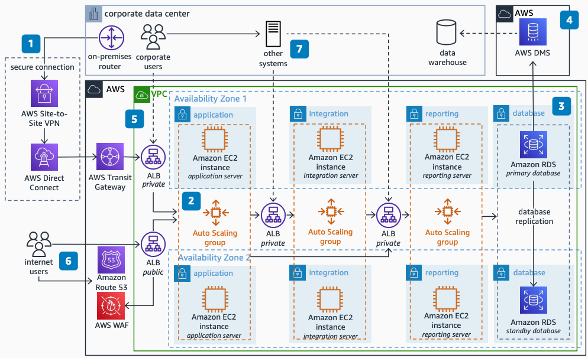

# IFS Maintenix Software Implementation on AWS

Publication date: **March 24, 2022 ([Diagram history](#maintenix-history "#maintenix-history"))**

You can use AWS to create a highly available, secure, flexible, and cost-effective
architecture to host [IFS Maintenix Aviation Maintenance Management Software](https://www.ifs.com/en/products/aviation-maintenance "https://www.ifs.com/en/products/aviation-maintenance").
This architecture connects on-premises systems to AWS with multiple networking
options.

This architecture deploys IFS Maintenix software servers across two
Availability Zones. It uses [Amazon RDS](../../../AmazonRDS/latest/UserGuide.md "../../../AmazonRDS/latest/UserGuide.md") for the database tier and [AWS Database Migration Service](../../../dms/latest/userguide.md "../../../dms/latest/userguide.md") for data
replication to your data warehouse.

## IFS Maintenix implementation diagram

The following steps describe the architecture:

1. Connect on-premises routers securely with high availability to a [Amazon VPC](../../../vpc/latest/userguide.md "../../../vpc/latest/userguide.md"). Use [AWS Direct Connect](../../../directconnect/latest/UserGuide.md "../../../directconnect/latest/UserGuide.md"), AWS Site-to-Site VPN, and
   [AWS Transit Gateway](../../../vpc/latest/tgw.md "../../../vpc/latest/tgw.md").
2. Deploy Maintenix software servers into [Amazon EC2](../../../AWSEC2/latest/UserGuide.md "../../../AWSEC2/latest/UserGuide.md") instances across two Availability
   Zones with Auto Scaling groups.
3. Deploy an Oracle database by using [Amazon RDS](../../../AmazonRDS/latest/UserGuide.md "../../../AmazonRDS/latest/UserGuide.md") configured with Multi-AZ for
   high availability with a failover standby instance.
4. Turn on Change Data Capture (CDC) with [AWS Database Migration Service](../../../dms/latest/userguide.md "../../../dms/latest/userguide.md"). Push changes to your data
   warehouse for analytical processing.
5. Provide access to the application tier for corporate-network users. Route
   requests through a private Application Load Balancer through AWS Transit Gateway into the
   Amazon EC2 Auto Scaling group.
6. Allow internet-connected users to access the application tier through a public
   Application Load Balancer. Use [Route 53](../../../Route53/latest/DeveloperGuide.md "../../../Route53/latest/DeveloperGuide.md") for domain name resolution.
   Protect the Application Load Balancer with [AWS WAF](../../../waf/latest/developerguide.md "../../../waf/latest/developerguide.md").
7. Configure the Integration and Reporting tiers for internal access only. Make
   them accessible from the application tier Auto Scaling group and from on-premises
   through private Application Load Balancers.

## Further reading

For additional information, see the following resources:

- [AWS Architecture Icons](https://aws.amazon.com/architecture/icons "https://aws.amazon.com/architecture/icons")
- [AWS Architecture Center](https://aws.amazon.com/architecture/ "https://aws.amazon.com/architecture/")
- [AWS Well-Architected](https://aws.amazon.com/architecture/well-architected "https://aws.amazon.com/architecture/well-architected")

## Diagram history

To receive updates about this reference architecture diagram, subscribe to the RSS
feed.

| Change              | Description                                     | Date           |
| ------------------- | ----------------------------------------------- | -------------- |
| Initial publication | Reference architecture diagram first published. | March 24, 2022 |

###### RSS subscription requirement

To subscribe to RSS updates, you must have an RSS plugin enabled for the browser you
are using.
