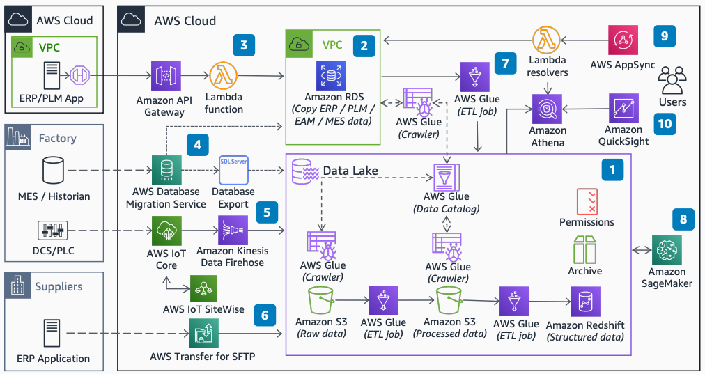

# Manufacturing Data Lake on AWS

Publication date: **June 29, 2020 ([Diagram history](#mdl-diagram-history "#mdl-diagram-history"))**

With this architecture, you can build a manufacturing data lake that combines operational
technology (OT) data from Industrial Internet of Things (IIoT) devices and factory applications
with enterprise application data. You can then run manufacturing analytical use cases and
predictions with machine learning (ML) models. This architecture uses [AWS Lake Formation](../../../lake-formation/latest/dg.md "../../../lake-formation/latest/dg.md"), [Amazon Simple Storage Service](../../../AmazonS3/latest/userguide.md "../../../AmazonS3/latest/userguide.md") (Amazon S3), [Amazon Redshift](../../../redshift/latest/dg.md "../../../redshift/latest/dg.md"), [AWS IoT Core](../../../iot/latest/developerguide.md "../../../iot/latest/developerguide.md"), [Amazon Data Firehose](../../../firehose/latest/dev.md "../../../firehose/latest/dev.md"), and [Amazon SageMaker AI](../../../sagemaker/latest/dg.md "../../../sagemaker/latest/dg.md").

## Manufacturing data lake architecture diagram

The following steps describe the architecture:

1. Create the data lake structure with Lake Formation or Amazon S3 and Amazon Redshift. Store raw and
   processed data in Amazon S3 buckets organized by data source and processing stage.
2. For structured relational data, create an [Amazon Relational Database Service](../../../AmazonRDS/latest/UserGuide.md "../../../AmazonRDS/latest/UserGuide.md") (Amazon RDS) instance within
   an [Amazon VPC](../../../vpc/latest/userguide.md "../../../vpc/latest/userguide.md").
3. For compatible enterprise applications, use [Amazon API Gateway](../../../apigateway/latest/developerguide.md "../../../apigateway/latest/developerguide.md") and [AWS Lambda](../../../lambda/latest/dg.md "../../../lambda/latest/dg.md") to create an interface into Amazon RDS.
4. For compatible databases, use [AWS Database Migration Service](../../../dms/latest/userguide.md "../../../dms/latest/userguide.md") to create copies or export structured
   data sets into the data lake.
5. For IIoT and automation equipment, use AWS IoT Core and Amazon Data Firehose to stream data
   into the data lake. [AWS IoT SiteWise](../../../iot-sitewise/latest/userguide.md "../../../iot-sitewise/latest/userguide.md") collects and organizes
   industrial equipment data.
6. For external or batch interfaces, use [AWS Transfer Family](../../../transfer/latest/userguide.md "../../../transfer/latest/userguide.md") to put data into the data lake.
7. Use [AWS Glue](../../../glue/latest/dg.md "../../../glue/latest/dg.md") to build the
   data catalog and create extract, transform, and load (ETL) jobs.
8. Use Amazon SageMaker AI to train and deploy ML models against data in the data lake.
9. Use AWS AppSync to build a GraphQL endpoint with Lambda resolvers. This endpoint
   provides a flexible API for consuming applications.
10. Build visualizations with [Amazon Quick Sight](../../../quicksight/latest/user/welcome.md "../../../quicksight/latest/user/welcome.md") by using [Amazon Athena](../../../athena/latest/ug.md "../../../athena/latest/ug.md") and Amazon Redshift.

## Further reading

For additional information, see the following resources:

- [AWS Architecture Icons](https://aws.amazon.com/architecture/icons "https://aws.amazon.com/architecture/icons")
- [AWS Architecture Center](https://aws.amazon.com/architecture "https://aws.amazon.com/architecture")
- [AWS Well-Architected](https://aws.amazon.com/architecture/well-architected "https://aws.amazon.com/architecture/well-architected")
- [Manufacturing on AWS](../manufacturing-on-aws/manufacturing-on-aws.md "../manufacturing-on-aws/manufacturing-on-aws.md")

## Diagram history

To be notified about updates to this reference architecture diagram, subscribe to the RSS feed.

| Change              | Description                                     | Date          |
| ------------------- | ----------------------------------------------- | ------------- |
| Initial publication | Reference architecture diagram first published. | June 29, 2020 |

###### RSS subscription

To subscribe to RSS updates, you must have an RSS plugin enabled for the browser that you are using.
