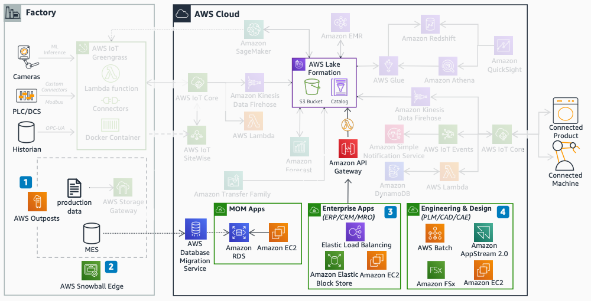

# Application hosting

The application hosting diagram shows how to run enterprise and engineering applications
on AWS.

1. Use [AWS Outposts](../../../outposts/latest/userguide.md "../../../outposts/latest/userguide.md") for latency-sensitive workloads
   that must run close to on-premises systems.
2. Use AWS Snowball Edge for disconnected or intermittent connectivity use cases.
3. Host enterprise applications on [Amazon EC2](../../../AWSEC2/latest/UserGuide.md "../../../AWSEC2/latest/UserGuide.md") with Auto Scaling and Elastic Load Balancing.
4. Use [Amazon FSx](../../../fsx/latest/LustreGuide.md "../../../fsx/latest/LustreGuide.md") and Amazon EC2 with WorkSpaces Applications for high
   performance computing (HPC), CAD, and CAE workloads.
