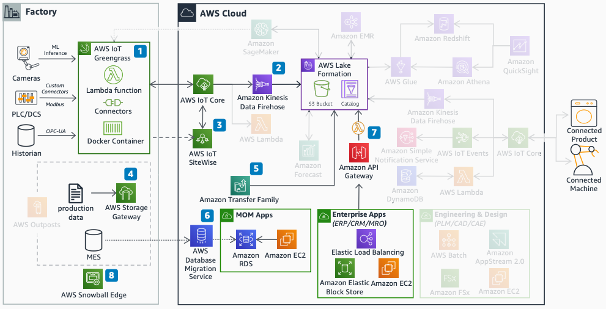

# Data ingestion

The data ingestion diagram shows how to bring data from factory floors and enterprise
applications into AWS.

1. Connect industrial devices with [AWS IoT Greengrass](../../../greengrass/v2/developerguide.md "../../../greengrass/v2/developerguide.md") on an Edge gateway.
2. Stream industrial data with [Amazon Data Firehose](../../../firehose/latest/dev.md "../../../firehose/latest/dev.md") into the data lake.
3. With [AWS IoT SiteWise](../../../iot-sitewise/latest/userguide.md "../../../iot-sitewise/latest/userguide.md"), model assets and visualize
   data with AWS IoT SiteWise Monitor.
4. Sync unstructured data with AWS Storage Gateway from on-premises file shares.
5. Use [AWS Transfer Family](../../../transfer/latest/userguide.md "../../../transfer/latest/userguide.md")
   for file transfers into the data lake.
6. Use [Amazon API Gateway](../../../apigateway/latest/developerguide.md "../../../apigateway/latest/developerguide.md") and [AWS Lambda](../../../lambda/latest/dg.md "../../../lambda/latest/dg.md") for enterprise application interfaces.
7. Use AWS Snowball Edge for large data set migration from on-premises systems.
8. Use [AWS Database Migration Service](../../../dms/latest/userguide.md "../../../dms/latest/userguide.md") to
   synchronize databases into [Amazon Relational Database Service](../../../AmazonRDS/latest/UserGuide.md "../../../AmazonRDS/latest/UserGuide.md") (Amazon RDS).
