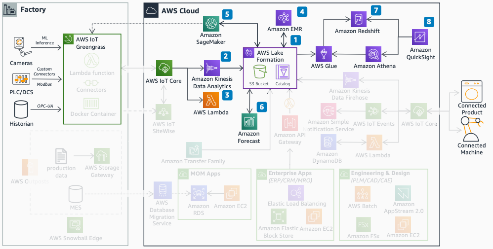

# Data lake and analytics

The data lake and analytics diagram shows how to process, analyze, and derive insights
from manufacturing data.

1. Use Lake Formation or Amazon S3 for the data lake structure to store raw and processed
   manufacturing data.
2. Use Amazon Managed Service for Apache Flink for streaming analytics on real-time
   factory data.
3. Use Lambda for near real-time analytics and event-driven processing.
4. Use [Amazon SageMaker AI](../../../sagemaker/latest/dg.md "../../../sagemaker/latest/dg.md") to
   build, train, and deploy ML models for predictive maintenance and quality.
5. Use [Amazon EMR](../../../emr/latest/ManagementGuide.md "../../../emr/latest/ManagementGuide.md") for
   large-scale data processing and transformation.
6. Use [Amazon Forecast](../../../forecast/latest/dg.md "../../../forecast/latest/dg.md") for demand forecasting.
7. Use [Amazon Redshift](../../../redshift/latest/dg.md "../../../redshift/latest/dg.md") for
   structured data warehousing and analytics.
8. Use [Amazon Quick Sight](../../../quicksight/latest/user/welcome.md "../../../quicksight/latest/user/welcome.md") with [Amazon Athena](../../../athena/latest/ug.md "../../../athena/latest/ug.md") and Amazon Redshift for business intelligence (BI)
   dashboards.
