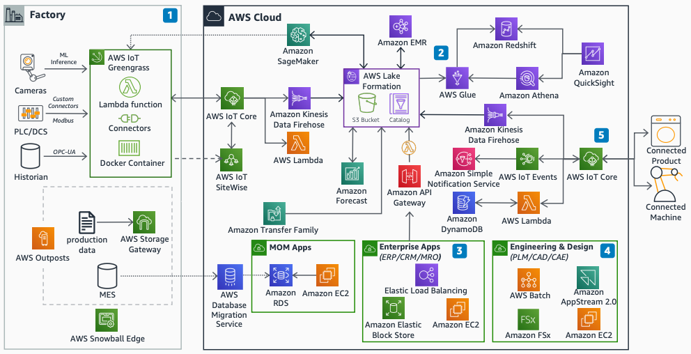

# Overview

The overview diagram shows how manufacturing workloads connect through a central
data lake on AWS.

1. Central to the architecture is a manufacturing data lake for analytics and machine
   learning (ML). Use [AWS Lake Formation](../../../lake-formation/latest/dg.md "../../../lake-formation/latest/dg.md") or [Amazon Simple Storage Service](../../../AmazonS3/latest/userguide.md "../../../AmazonS3/latest/userguide.md") (Amazon S3) to structure your data lake.
2. Establish smart factories by connecting Industrial Internet of Things (IIoT) devices
   to the cloud with hybrid infrastructure.
3. Host enterprise applications with cost-effective, resilient AWS architecture.
4. Use Amazon EC2 Spot Instances and GPU instances for computer-aided design (CAD) and
   computer-aided engineering (CAE) workloads.
5. Build smart products for connected products and machines that send telemetry to the
   cloud.
