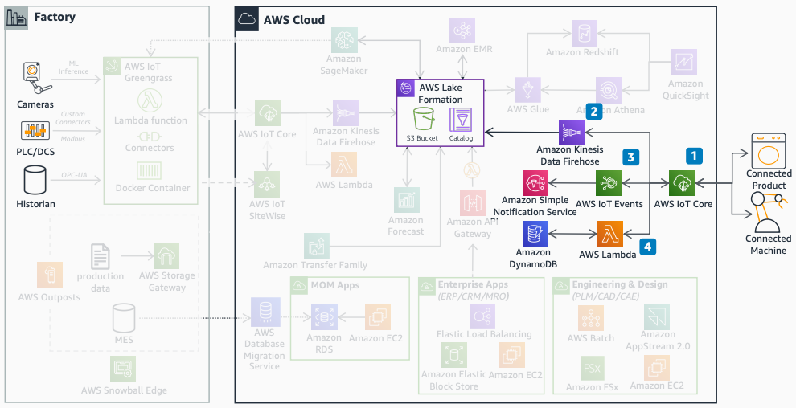

# Smart products

The smart products diagram shows how to connect manufactured products and machines to
AWS for telemetry and event processing.

1. Use [AWS IoT Core](../../../iot/latest/developerguide.md "../../../iot/latest/developerguide.md")
   to connect products by using MQTT (Message Queuing Telemetry Transport).
2. Ingest telemetry to Amazon S3 with Amazon Data Firehose for durable storage.
3. Define event logic with [AWS IoT Events](../../../whitepapers/latest/aws-overview/internet-of-things-services.md#aws-iot-events "../../../whitepapers/latest/aws-overview/internet-of-things-services.md#aws-iot-events") and [Amazon SNS](../../../sns/latest/dg.md "../../../sns/latest/dg.md") for alerting.
4. Build microservices with Lambda and [Amazon DynamoDB](../../../amazondynamodb/latest/developerguide.md "../../../amazondynamodb/latest/developerguide.md") to process telemetry and
   serve applications.
