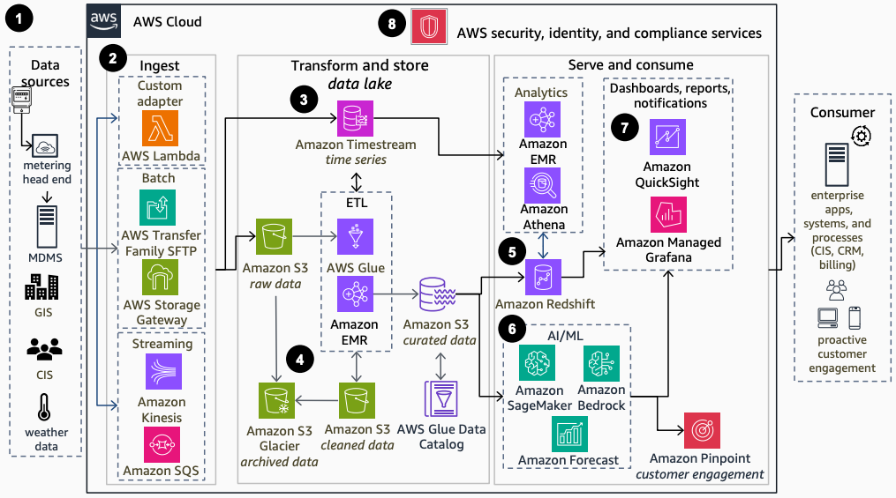

# Meter Data Analytics for Utilities

Publication date: **September 17, 2024 ([Diagram history](#mda-history "#mda-history"))**

With this architecture, you can build modern meter data analytics solutions. These solutions
improve meter data availability for operational and customer insights. The solution unlocks data
silos by using appropriate data stores, analytics, and AI/ML tools. Use cases include meter and
circuit anomaly detection, circuit balancing, energy theft prevention, and demand prediction.
Key services include [Amazon Kinesis](../../../streams/latest/dev.md "../../../streams/latest/dev.md")
for streaming, [AWS Glue](../../../glue/latest/dg.md "../../../glue/latest/dg.md") for ETL, [Amazon SageMaker AI](../../../sagemaker/latest/dg.md "../../../sagemaker/latest/dg.md") for ML, and [Amazon Timestream](../../../timestream/latest/developerguide.md "../../../timestream/latest/developerguide.md") for
time-series storage.

## Meter data analytics diagram

The following steps describe the data pipeline and analytics components for this
architecture:

1. Ingest data from various sources including meter data management systems (MDMS), head
   end systems (HES), customer information systems (CIS), and geographic information systems
   (GIS).
2. Ingest customer and meter data to AWS by using both batch and streaming approaches
   based on your use case. Choose from multiple tools such as [AWS Lambda](../../../lambda/latest/dg.md "../../../lambda/latest/dg.md") for custom adapters, [AWS Transfer Family](../../../transfer/latest/userguide/what-is-aws-transfer-family.md "../../../transfer/latest/userguide/what-is-aws-transfer-family.md") for
   SFTP, [AWS Storage Gateway](../../../storagegateway/latest/userguide.md "../../../storagegateway/latest/userguide.md") for batch processing, and
   Amazon Kinesis and [Amazon Simple Queue Service](../../../AWSSimpleQueueService/latest/SQSDeveloperGuide.md "../../../AWSSimpleQueueService/latest/SQSDeveloperGuide.md") for streaming
   data.
3. Store and analyze meter data efficiently by using Amazon Timestream, a time-series database
   service. Power near-real-time dashboards and time-series analytics for mission-critical
   applications.
4. Automate extract, transform, and load (ETL) processes with AWS Glue, including file
   transforms, deduplication, and value-add processing such as running meter data validation,
   estimation, and editing (VEE) processes and creating billing determinants. Use Amazon S3
   Glacier as low-cost storage for archival copies and retention compliance. Store final
   curated data sets in an [Amazon Simple Storage Service](../../../AmazonS3/latest/userguide.md "../../../AmazonS3/latest/userguide.md") bucket as the data lake single source
   of truth for downstream analytics and ML work. Use AWS Glue to automate data schema
   discovery and metadata tagging.
5. Query petabytes of structured and semi-structured data or time series across your data
   warehouse and data lake by using standard SQL with [Amazon Redshift](../../../redshift/latest/mgmt.md "../../../redshift/latest/mgmt.md"). Perform complex analytics with [Amazon EMR](../../../emr/latest/ManagementGuide.md "../../../emr/latest/ManagementGuide.md") and run data
   discovery queries against your lake and warehouse with [Amazon Athena](../../../athena/latest/ug.md "../../../athena/latest/ug.md").
6. Use SageMaker AI to detect grid anomalies, forecast energy usage, and predict equipment
   failures. Use [Amazon Bedrock](../../../bedrock/latest/userguide.md "../../../bedrock/latest/userguide.md") integration to chat with your meter
   data.
7. Create and publish interactive dashboards that include AI/ML insights with [Amazon Quick Sight](../../../quicksight/latest/developerguide/welcome.md "../../../quicksight/latest/developerguide/welcome.md") or [Amazon Managed Service for
   Grafana](../../../grafana/latest/userguide.md "../../../grafana/latest/userguide.md"). Access dashboards from any device and embed them into
   your applications and websites. Communicate proactively with customers by using [Amazon Pinpoint](../../../pinpoint/latest/userguide.md "../../../pinpoint/latest/userguide.md") to measure
   customer engagement across multiple channels including email, SMS, and mobile push
   notifications. Create personalized customer target segments and campaigns by using
   analytics and ML outputs with Amazon Pinpoint.
8. Use AWS security, identity, and compliance services to keep your data safe and
   secure.

## Further reading

For additional information, see the following resources:

- [AWS Architecture Icons](https://aws.amazon.com/architecture/icons "https://aws.amazon.com/architecture/icons")
- [AWS Architecture Center](https://aws.amazon.com/architecture/ "https://aws.amazon.com/architecture/")
- [AWS
  Well-Architected](https://aws.amazon.com/architecture/well-architected "https://aws.amazon.com/architecture/well-architected")

## Diagram history

To receive updates about this reference architecture diagram, subscribe to the RSS
feed.

| Change              | Description                                     | Date               |
| ------------------- | ----------------------------------------------- | ------------------ |
| Initial publication | Reference architecture diagram first published. | September 17, 2024 |

###### RSS subscription requirement

To subscribe to RSS updates, you must have an RSS plugin enabled for the browser you are
using.
