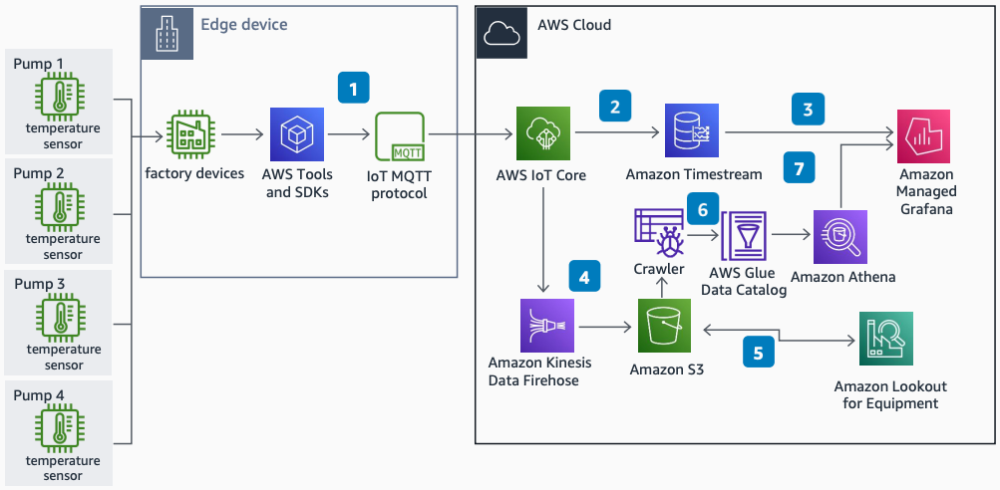

# Machine Learning Enabled Predictive Maintenance on AWS

Publication date: **September 13, 2022 ([Diagram history](#mlpm-diagram-history "#mlpm-diagram-history"))**

With this architecture, you can implement condition-based maintenance with near real-time
inference results and notifications for sucker rod pumping systems. These systems are the most
widely applied artificial lift equipment in oil and gas. This architecture uses [AWS IoT Core](../../../iot/latest/developerguide.md "../../../iot/latest/developerguide.md"), [Amazon Timestream](../../../timestream/latest/developerguide.md "../../../timestream/latest/developerguide.md"), [Amazon Managed Grafana](../../../grafana/latest/userguide.md "../../../grafana/latest/userguide.md"), [Amazon Data Firehose](../../../firehose/latest/dev.md "../../../firehose/latest/dev.md"), and [Amazon Lookout for Equipment](../../../lookout-for-equipment/latest/ug.md "../../../lookout-for-equipment/latest/ug.md").

## ML predictive maintenance architecture diagram

The following steps describe the architecture:

1. Use Message Queuing Telemetry Transport (MQTT) protocol in an IoT device SDK to
   ingest data to AWS IoT Core from sucker rod pumps.
2. Configure an IoT rule in AWS IoT Core to store data in Amazon Timestream as time series
   data.
3. Visualize and monitor sensor data with Amazon Managed Grafana from a Timestream database.
4. Configure an IoT rule in AWS IoT Core to capture, transform, and deliver data to
   [Amazon S3](../../../AmazonS3/latest/userguide.md "../../../AmazonS3/latest/userguide.md") with
   Amazon Data Firehose.
5. Amazon Lookout for Equipment analyzes data from Amazon S3 and trains a unique ML model to detect equipment
   abnormalities in near real time. Store inference results in Amazon S3.
6. Use [AWS Glue](../../../glue/latest/dg.md "../../../glue/latest/dg.md") Data Catalog to
   categorize data. [Amazon Athena](../../../athena/latest/ug.md "../../../athena/latest/ug.md") integrates with the catalog for on-demand
   queries.
7. Display inference results from Athena with Amazon Managed Grafana.

## Further reading

For additional information, see the following resources:

- [AWS Architecture Icons](https://aws.amazon.com/architecture/icons "https://aws.amazon.com/architecture/icons")
- [AWS Architecture Center](https://aws.amazon.com/architecture "https://aws.amazon.com/architecture")
- [AWS Well-Architected](https://aws.amazon.com/architecture/well-architected "https://aws.amazon.com/architecture/well-architected")
- [Industrial Data Platform on AWS](../industrial-data-platform/industrial-data-platform.md "../industrial-data-platform/industrial-data-platform.md")

## Diagram history

To be notified about updates to this reference architecture diagram, subscribe to the RSS feed.

| Change              | Description                                     | Date               |
| ------------------- | ----------------------------------------------- | ------------------ |
| Initial publication | Reference architecture diagram first published. | September 13, 2022 |

###### RSS subscription

To subscribe to RSS updates, you must have an RSS plugin enabled for the browser that you are using.
