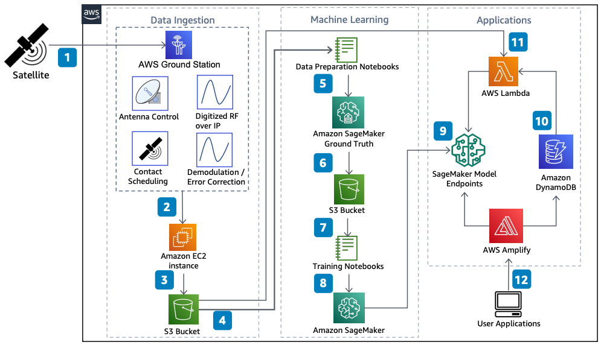

# Run Machine Learning Algorithms with Satellite Data

Publication date: **May 24, 2021 ([Diagram history](#diagram-history "#diagram-history"))**

This architecture shows how to use [AWS Ground Station](../../../ground-station/latest/ug/what-is-aws-ground-station.md "../../../ground-station/latest/ug/what-is-aws-ground-station.md") to ingest satellite imagery. With [Amazon SageMaker AI](../../../sagemaker/latest/dg/whatis.md "../../../sagemaker/latest/dg/whatis.md"), you can label image data, train an ML model, and deploy inferences for automated image analysis.

## Run Machine Learning Algorithms with Satellite Data

The following steps describe the architecture:

1. The satellite sends data and imagery to the AWS Ground Station antenna.
2. AWS Ground Station delivers baseband or digitized RF-over-IP data to an [Amazon Elastic Compute Cloud](../../../AWSEC2/latest/UserGuide/concepts.md "../../../AWSEC2/latest/UserGuide/concepts.md") instance.
3. The Amazon EC2 instance receives and processes the data, and then stores it in an [Amazon Simple Storage Service](../../../AmazonS3/latest/userguide/Welcome.md "../../../AmazonS3/latest/userguide/Welcome.md") bucket.
4. A Jupyter Notebook ingests data from the Amazon S3 bucket to prepare the data for training.
5. SageMaker AI Ground Truth labels the images.
6. The labeled images are stored in the Amazon S3 bucket.
7. The Jupyter Notebook hosts the training algorithm and code.
8. SageMaker AI runs the training algorithm on the data and trains the ML model.
9. SageMaker AI deploys the ML models to an endpoint.
10. The SageMaker AI ML model processes image data and stores the generated inferences and metadata in [Amazon DynamoDB](../../../amazondynamodb/latest/developerguide/Introduction.md "../../../amazondynamodb/latest/developerguide/Introduction.md").
11. Image data received into Amazon S3 automatically triggers an [AWS Lambda](../../../lambda/latest/dg/welcome.md "../../../lambda/latest/dg/welcome.md") function to run ML services on the image data.
12. Applications interact with [AWS Amplify](../../../amplify/latest/userguide/welcome.md "../../../amplify/latest/userguide/welcome.md") to access the ML algorithm and database.

## Further reading

For additional information, refer to the following resources:

- [AWS Architecture Icons](https://aws.amazon.com/architecture/icons "https://aws.amazon.com/architecture/icons")
- [AWS Architecture Center](https://aws.amazon.com/architecture "https://aws.amazon.com/architecture")
- [AWS Well-Architected](https://aws.amazon.com/architecture/well-architected "https://aws.amazon.com/architecture/well-architected")
- [AWS Ground Station product page](https://aws.amazon.com/ground-station/ "https://aws.amazon.com/ground-station/")
- [Amazon SageMaker AI product page](https://aws.amazon.com/sagemaker/ "https://aws.amazon.com/sagemaker/")

## Diagram history

To be notified about updates to this reference architecture diagram, subscribe to the RSS feed.

| Change              | Description                                     | Date         |
| ------------------- | ----------------------------------------------- | ------------ |
| Initial publication | Reference architecture diagram first published. | May 24, 2021 |

###### Note

To subscribe to RSS updates, you must have an RSS plugin enabled for the browser you are using.
