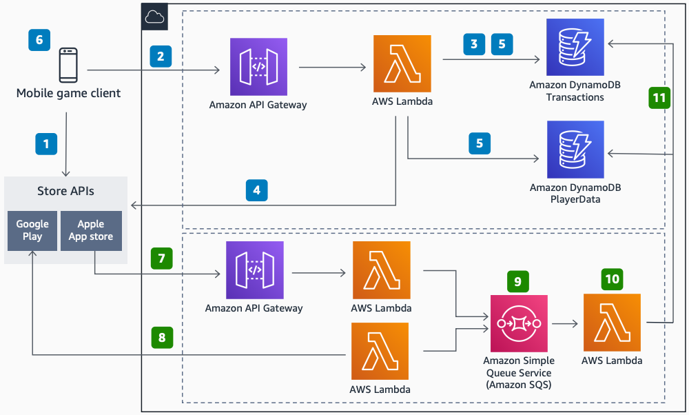

# Mobile In-App Purchase Validation on AWS

Publication date: **January 1, 2021 ([Diagram history](#iap-history "#iap-history"))**

This architecture provides a serverless solution for validating in-app purchases from
the Google Play Store and Apple App Store, and for managing refunds. The
architecture uses [Amazon API Gateway](../../../apigateway/latest/developerguide.md "../../../apigateway/latest/developerguide.md"),
[AWS Lambda](../../../lambda/latest/dg.md "../../../lambda/latest/dg.md"), and
[Amazon DynamoDB](../../../amazondynamodb/latest/developerguide.md "../../../amazondynamodb/latest/developerguide.md") to
process transactions securely at scale.

## Mobile In-App Purchase Validation on AWS diagram

The following steps describe the purchase validation flow:

1. The mobile game client makes a purchase by using the OS-specific SDK and stores the
   receipt locally.
2. The game client makes an API request to API Gateway to validate the receipt and receive
   purchased items.
3. The Lambda function checks the **Transactions** table in DynamoDB to
   validate that the receipt has not been used previously.
4. The Lambda function validates the receipt through the Google Play Store
   or Apple App Store API.
5. After validation, the Lambda function adds items to the
   **PlayerData** table in DynamoDB and adds the receipt to the
   **Transactions** table with any additional metadata.
6. The client receives a success message, locally synchronizes the purchased items data,
   and deletes the local receipt copy.

The following steps describe the refund flow:

7. API Gateway receives notifications on refunded transactions on iOS. A scheduled Lambda
   function queries refunded transactions on Android.
8. Refunded transactions are pushed to an [Amazon Simple Queue Service](../../../AWSSimpleQueueService/latest/SQSDeveloperGuide.md "../../../AWSSimpleQueueService/latest/SQSDeveloperGuide.md") queue by the
   Lambda functions.
9. A Lambda function handles the refund, including any additional actions like closing the
   player account.
10. A Lambda function updates the DynamoDB tables to remove items and mark the transaction as
    refunded.

## Further reading

For additional information, see the following resources:

- [AWS Architecture Icons](https://aws.amazon.com/architecture/icons "https://aws.amazon.com/architecture/icons")
- [AWS Architecture Center](https://aws.amazon.com/architecture/ "https://aws.amazon.com/architecture/")
- [AWS
  Well-Architected](https://aws.amazon.com/architecture/well-architected "https://aws.amazon.com/architecture/well-architected")

## Diagram history

To be notified about updates to this reference architecture diagram, subscribe to the RSS
feed.

| Change              | Description                                     | Date            |
| ------------------- | ----------------------------------------------- | --------------- |
| Initial publication | Reference architecture diagram first published. | January 1, 2021 |

###### Note

To subscribe to RSS updates, you must have an RSS plugin enabled for the browser you are
using.
