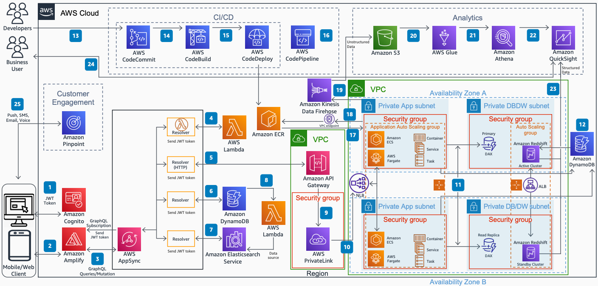

# Modern Serverless Mobile/Web Application Architecture

Publication date: **May 10, 2021 ([Diagram history](#diagram-history "#diagram-history"))**

This architecture shows how to build a modern serverless mobile and web application in AWS. You use [AWS AppSync](../../../appsync/latest/devguide/what-is-appsync.md "../../../appsync/latest/devguide/what-is-appsync.md") for the frontend and Amazon ECS on AWS Fargate containers for backend processing, along with continuous integration and delivery (CI/CD) and analytics to derive insight from application logs and structured data.

## Modern Serverless Mobile/Web Application Architecture

The following steps describe the architecture:

1. Users authenticate with [Amazon Cognito](../../../cognito/latest/developerguide/what-is-amazon-cognito.md "../../../cognito/latest/developerguide/what-is-amazon-cognito.md") user pools by retrieving a JWT token, and then use those tokens to retrieve AWS credentials that allow the app to access other AWS services.
2. The mobile and web client interacts with [AWS Amplify](../../../amplify/latest/userguide/welcome.md "../../../amplify/latest/userguide/welcome.md") frameworks, which allow communication with backend services from iOS, Android, web, and React Native front ends.
3. The authenticated clients call AWS AppSync to perform GraphQL operations such as queries, mutations, and subscriptions.
4. The Lambda resolvers communicate with [AWS Lambda](../../../lambda/latest/dg/welcome.md "../../../lambda/latest/dg/welcome.md") using temporary IAM credentials based on assumed IAM roles. A JWT token specific to the authenticated user is forwarded to Lambda for processing.
5. The [Amazon DynamoDB](../../../amazondynamodb/latest/developerguide/Introduction.md "../../../amazondynamodb/latest/developerguide/Introduction.md") resolver connects existing tables to a GraphQL schema by creating a data source to read, write, and subscribe to real-time data.
6. Lambda sends data to the Amazon Elasticsearch Service domain from DynamoDB whenever new data arrives in the database table, triggering an event notification to Lambda for indexing.
7. The HTTP resolver and endpoints are protected with temporary IAM credentials. A JWT token is forwarded to [Amazon API Gateway](../../../apigateway/latest/developerguide/welcome.md "../../../apigateway/latest/developerguide/welcome.md").
8. API Gateway uses AWS PrivateLink to encapsulate connections between API Gateway and [Amazon Elastic Container Service](../../../AmazonECS/latest/developerguide/Welcome.md "../../../AmazonECS/latest/developerguide/Welcome.md") on [AWS Fargate](../../../AmazonECS/latest/developerguide/AWS_Fargate.md "../../../AmazonECS/latest/developerguide/AWS_Fargate.md") configured in another VPC with a security group controlling access.
9. A Network Load Balancer (NLB) is configured with a specific port assigned to each service through private integrations towards the Amazon ECS on AWS Fargate cluster, running across multiple Availability Zones.
10. Amazon ECS on AWS Fargate connects to Amazon Elastic Container Registry (Amazon ECR) through an interface VPC endpoint for private access to ECR APIs through private IP addresses.
11. The application workload hosted in Amazon ECS on AWS Fargate containers accesses DynamoDB Accelerator (DAX) in the in-memory cache layer to retrieve frequently accessed information.
12. DynamoDB provides serverless performance at scale for mission-critical workloads including support for ACID transactions.
13. AWS CodeCommit acts as a repository for storing application code whenever the developer modifies or commits changes.
14. AWS CodeBuild compiles source code, runs tests, and produces software packages ready to deploy on a dynamically created build server.
15. AWS CodeDeploy automates software deployments to AWS Fargate with code associated to new features based on developer changes.
16. [AWS CodePipeline](../../../codepipeline/latest/userguide/welcome.md "../../../codepipeline/latest/userguide/welcome.md") creates an end-to-end pipeline that fetches application code, builds and tests with CodeBuild, and deploys from Amazon ECR to Fargate.
17. The latest Docker images from the build process are stored in Amazon ECR and pulled for deployment in Fargate across multiple Availability Zones for high availability.
18. Amazon Redshift complements DynamoDB with advanced business intelligence capabilities. DynamoDB table data is copied into Amazon Redshift for complex data analysis queries including joins.
19. The unstructured data from Amazon ECS on AWS Fargate is sent to [Amazon Kinesis Data Firehose](../../../firehose/latest/dev/what-is-this-service.md "../../../firehose/latest/dev/what-is-this-service.md") in near real time towards the data lake in Amazon Simple Storage Service.
20. [Amazon Quick Sight](../../../quicksight/latest/user/welcome.md "../../../quicksight/latest/user/welcome.md") creates and publishes interactive business intelligence dashboards using [Amazon Athena](../../../athena/latest/ug/what-is.md "../../../athena/latest/ug/what-is.md") as the data source.
21. [AWS Glue](../../../glue/latest/dg/what-is-glue.md "../../../glue/latest/dg/what-is-glue.md") ETL connects to data stored in [Amazon Simple Storage Service](../../../AmazonS3/latest/userguide/Welcome.md "../../../AmazonS3/latest/userguide/Welcome.md") using the AWS Glue Data Catalog to store metadata such as table and column names.
22. Amazon Athena is an interactive query service that analyzes data registered with the AWS Glue Data Catalog using Presto to process DML statements.
23. User management differs between the [Quick Standard and Enterprise editions](../../../quicksight/latest/user/editions.md "../../../quicksight/latest/user/editions.md"). Both editions support identity federation through SAML 2.0.
24. Amazon Kinesis Data Firehose is serverless and requires no administration with pay-as-you-go pricing for the volume of data you transmit and process.
25. Amazon Pinpoint segments the campaign audience to reach the right customers and personalizes messages with the right content for push, SMS, email, and voice.

## Further reading

For additional information, refer to the following resources:

- [AWS Architecture Icons](https://aws.amazon.com/architecture/icons "https://aws.amazon.com/architecture/icons")
- [AWS Architecture Center](https://aws.amazon.com/architecture "https://aws.amazon.com/architecture")
- [AWS Well-Architected](https://aws.amazon.com/architecture/well-architected "https://aws.amazon.com/architecture/well-architected")

## Diagram history

To be notified about updates to this reference architecture diagram, subscribe to the RSS feed.

| Change              | Description                                     | Date         |
| ------------------- | ----------------------------------------------- | ------------ |
| Initial publication | Reference architecture diagram first published. | May 10, 2021 |

###### Note

To subscribe to RSS updates, you must have an RSS plugin enabled for the browser you are using.
