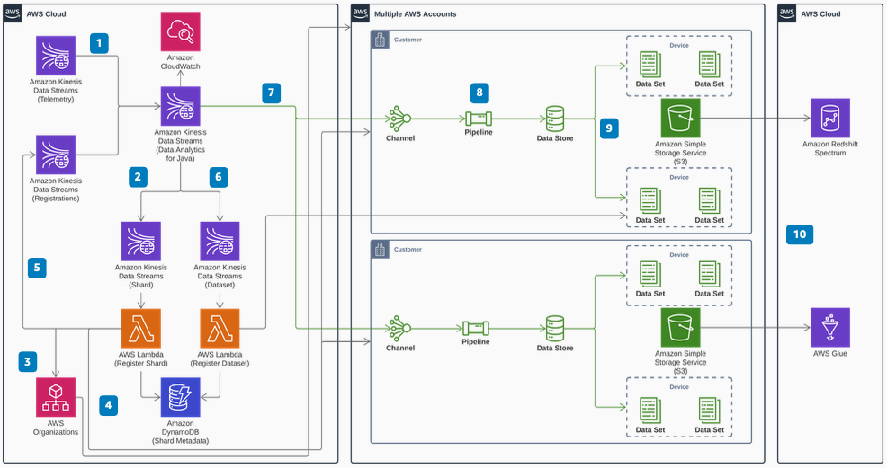

# Creating Multi-Account IoT Pipelines On-The-Fly on AWS

Publication date: **October 16, 2020 ([Diagram history](#diagram-history "#diagram-history"))**

This reference architecture diagram shows how to deploy AWS IoT Analytics pipelines into different AWS Organizations accounts. It uses Amazon Managed Service for Apache Flink to buffer and route data from new devices and groups.

## Creating Multi-Account IoT Pipelines On-The-Fly on AWS

1. Ingest device telemetry data through the telemetry [Amazon Kinesis](../../../streams/latest/dev/introduction.md "../../../streams/latest/dev/introduction.md") stream.
2. Detect when Amazon Managed Service for Apache Flink ingests an unregistered device group (shard). Buffer incoming messages in a custom window and emit an event.
3. The shard [AWS Lambda](../../../lambda/latest/dg/welcome.md "../../../lambda/latest/dg/welcome.md") function creates a new account and [Amazon Simple Storage Service (Amazon S3)](../../../AmazonS3/latest/userguide/Welcome.md "../../../AmazonS3/latest/userguide/Welcome.md") bucket if an account does not have enough capacity.
4. Use the AWS SDK to create an AWS IoT Analytics channel, Pipeline, and data store for the new shard and register them in [Amazon DynamoDB](../../../amazondynamodb/latest/developerguide/Introduction.md "../../../amazondynamodb/latest/developerguide/Introduction.md").
5. Emit a registration event that contains the AWS IoT Analytics channel information. This event triggers the Amazon Managed Service for Apache Flink window to continue processing buffered messages for this shard.
6. Detect new devices in the group and emit an asynchronous event to the register-dataset Lambda function. This creates an AWS IoT Analytics dataset while continuing to ingest the telemetry.
7. For each device group, Amazon Managed Service for Apache Flink reads the AWS IoT Analytics channel registration. It then uploads device data to the correct channel in the registered account.
8. AWS IoT Analytics stores device group messages in the channel and transforms them in the pipeline. AWS IoT Analytics then stores the transformed data in the data store backed by Amazon S3.
9. Each device's AWS IoT Analytics dataset uses a delta time query on the datastore. This filters data to a specific device for the most recent 5 minutes to simplify queries.
10. Query device data with [AWS Glue](../../../glue/latest/dg/what-is-glue.md "../../../glue/latest/dg/what-is-glue.md") or [Amazon Redshift Spectrum](../../../redshift/latest/dg/welcome.md "../../../redshift/latest/dg/welcome.md").

## Further reading

For additional information, refer to

- [AWS Architecture Icons](https://aws.amazon.com/architecture/icons "https://aws.amazon.com/architecture/icons")
- [AWS Architecture Center](https://aws.amazon.com/architecture "https://aws.amazon.com/architecture")
- [AWS Well-Architected](https://aws.amazon.com/architecture/well-architected "https://aws.amazon.com/architecture/well-architected")
- [AWS IoT product page](https://aws.amazon.com/iot/ "https://aws.amazon.com/iot/")

## Diagram history

To be notified about updates to this reference architecture diagram, subscribe to the RSS feed.

| Change              | Description                                     | Date             |
| ------------------- | ----------------------------------------------- | ---------------- |
| Initial publication | Reference architecture diagram first published. | October 16, 2020 |

###### Note

To subscribe to RSS updates, you must have an RSS plugin enabled for the browser you are using.
