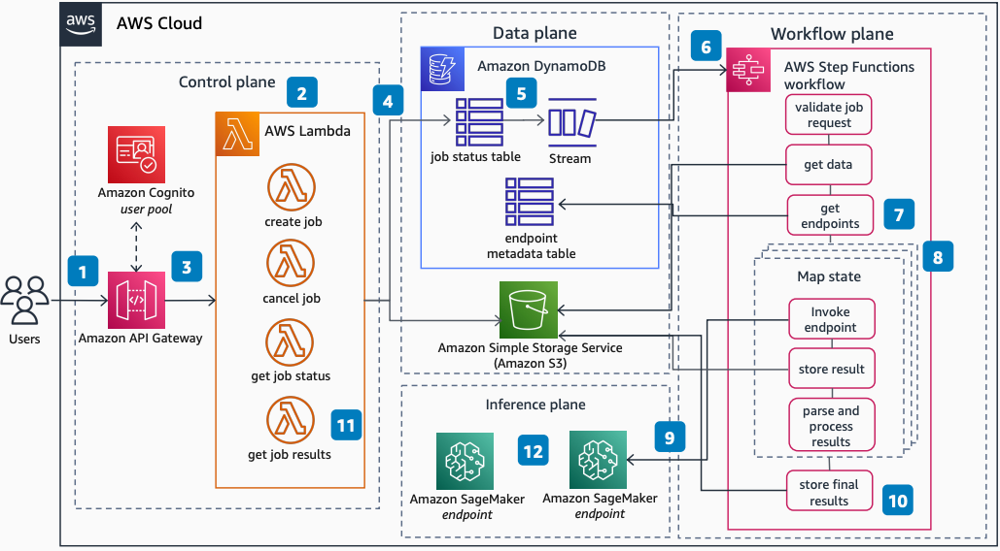

# Multi-Model Inference Workflow Orchestration

Publication date: **March 28, 2022 ([Diagram history](#diagram-history "#diagram-history"))**

This architecture shows how to orchestrate running multiple ML models for complex ML-driven insight. With [AWS Step Functions](../../../step-functions/latest/dg/welcome.md "../../../step-functions/latest/dg/welcome.md") and [Amazon SageMaker AI](../../../sagemaker/latest/dg/whatis.md "../../../sagemaker/latest/dg/whatis.md"), you can run parallel inference jobs and aggregate results.

## Multi-Model Inference Workflow Orchestration

The following steps describe the architecture:

1. [Amazon API Gateway](../../../apigateway/latest/developerguide/welcome.md "../../../apigateway/latest/developerguide/welcome.md") provides a RESTful interface for users and administrators. [Amazon Cognito](../../../cognito/latest/developerguide/what-is-amazon-cognito.md "../../../cognito/latest/developerguide/what-is-amazon-cognito.md") user pools provide authentication.
2. A new job is created by a `POST` request to `/create-job` on the API, with the data to run insights on. This invokes the create job [AWS Lambda](../../../lambda/latest/dg/welcome.md "../../../lambda/latest/dg/welcome.md") function.
3. The function uploads the data to an [Amazon Simple Storage Service](../../../AmazonS3/latest/userguide/Welcome.md "../../../AmazonS3/latest/userguide/Welcome.md") bucket and adds job information to an [Amazon DynamoDB](../../../amazondynamodb/latest/developerguide/Introduction.md "../../../amazondynamodb/latest/developerguide/Introduction.md") table for tracking.
4. Lambda functions provide logic for API methods exposed through API Gateway. These allow jobs to be created, monitored, and facilitate retrieval of results.
5. The new item in the table triggers a DynamoDB stream which in turn triggers the Step Functions workflow for inference.
6. The Step Functions workflow orchestrates all steps required to run multiple ML inference jobs against the provided data object.
7. Metadata information about the ML endpoints is stored in a DynamoDB table for use in the workflow.
8. A map state in the step function calls each ML endpoint and stores the results in parallel. This allows the workflow to scale to any number of ML endpoint invocations.
9. SageMaker AI model endpoints host the ML models. The workflow invokes these endpoints per category.
10. The final results of all the ML insights gathered for the data are stored in Amazon S3.
11. After the workflow completes, you can retrieve the final results through a `GET` request to `/get-job-results`. This invokes the get job results Lambda function, which reads the Amazon S3 bucket.
12. Multi-model endpoints can extend each model type with extra optimizations, such as language-specific inference per category.

## Further reading

For additional information, refer to the following resources:

- [AWS Architecture Icons](https://aws.amazon.com/architecture/icons "https://aws.amazon.com/architecture/icons")
- [AWS Architecture Center](https://aws.amazon.com/architecture "https://aws.amazon.com/architecture")
- [AWS Well-Architected](https://aws.amazon.com/architecture/well-architected "https://aws.amazon.com/architecture/well-architected")
- [Amazon SageMaker AI product page](https://aws.amazon.com/sagemaker/ "https://aws.amazon.com/sagemaker/")
- [AWS Step Functions product page](https://aws.amazon.com/step-functions/ "https://aws.amazon.com/step-functions/")

## Diagram history

To be notified about updates to this reference architecture diagram, subscribe to the RSS feed.

| Change              | Description                                     | Date           |
| ------------------- | ----------------------------------------------- | -------------- |
| Initial publication | Reference architecture diagram first published. | March 28, 2022 |

###### Note

To subscribe to RSS updates, you must have an RSS plugin enabled for the browser you are using.
