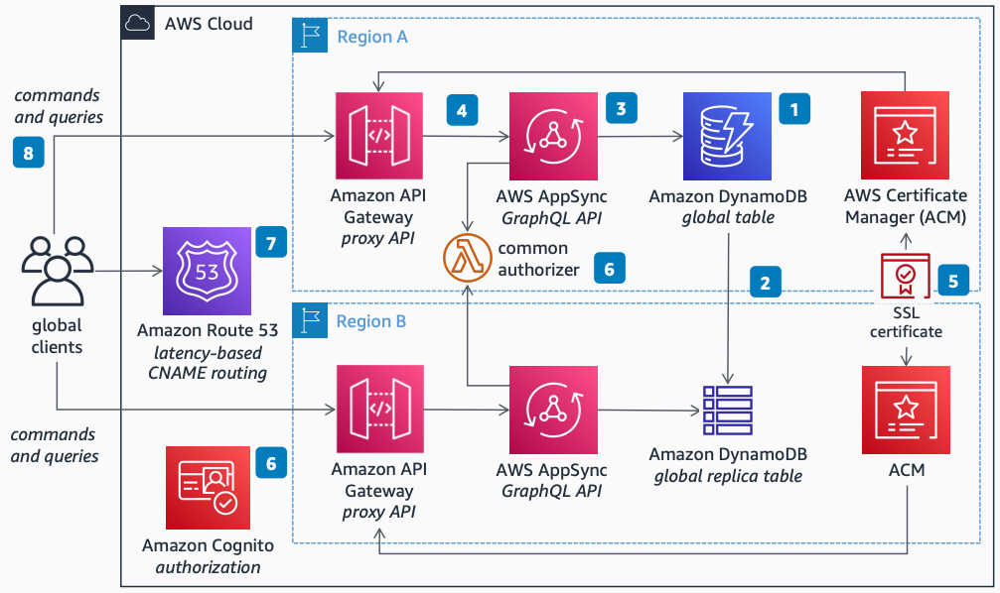

# Multi-Region Custom-Domain AppSync Proxy API

Publication date: **May 6, 2022 ([Diagram history](#diagram-history "#diagram-history"))**

This architecture shows how to reduce latency for end users while increasing availability by providing GraphQL API endpoints in multiple AWS Regions. You use [Amazon AppSync](../../../appsync/latest/devguide/what-is-appsync.md "../../../appsync/latest/devguide/what-is-appsync.md") with active-active real-time data synchronization supported by [Amazon DynamoDB](../../../amazondynamodb/latest/developerguide/Introduction.md "../../../amazondynamodb/latest/developerguide/Introduction.md") Global Tables.

## Multi-Region Custom-Domain AppSync Proxy API

The following steps describe the architecture:

1. Create one or more DynamoDB database tables in the first AWS Region to store your workload's data. Enable the DynamoDB Global Table feature to propagate data changes bidirectionally in multi-active mode to all other Regions.
2. Create an Amazon AppSync GraphQL API endpoint in each Region in scope, using DynamoDB Global Tables to store and replicate your workload's data.
3. Create an [Amazon API Gateway](../../../apigateway/latest/developerguide/welcome.md "../../../apigateway/latest/developerguide/welcome.md") proxy API endpoint in each Region in scope, forwarding all requests to the same Regional AppSync endpoint.
4. Create or import an SSL certificate for your domain to the AWS Certificate Manager (ACM) of each Region. Configure each Regional API Gateway to support HTTPS requests by referencing your domain's SSL certificate.
5. Configure all Regional AppSync endpoints to use a common authorization mechanism using [Amazon Cognito](../../../cognito/latest/developerguide/what-is-amazon-cognito.md "../../../cognito/latest/developerguide/what-is-amazon-cognito.md") or a common [AWS Lambda](../../../lambda/latest/dg/welcome.md "../../../lambda/latest/dg/welcome.md") authorizer for seamless client authorization.
6. Configure [Amazon Route 53](../../../Route53/latest/DeveloperGuide/Welcome.md "../../../Route53/latest/DeveloperGuide/Welcome.md") to forward your domain's requests to the Regional API Gateway endpoint with the lowest latency to the client's location.
7. Clients across the world send requests for commands and queries to the nearest Region.
8. DynamoDB Global Tables automatically replicate data changes to all configured Regions.

## Further reading

For additional information, refer to the following resources:

- [AWS Architecture Icons](https://aws.amazon.com/architecture/icons "https://aws.amazon.com/architecture/icons")
- [AWS Architecture Center](https://aws.amazon.com/architecture "https://aws.amazon.com/architecture")
- [AWS Well-Architected](https://aws.amazon.com/architecture/well-architected "https://aws.amazon.com/architecture/well-architected")

## Diagram history

To be notified about updates to this reference architecture diagram, subscribe to the RSS feed.

| Change              | Description                                     | Date        |
| ------------------- | ----------------------------------------------- | ----------- |
| Initial publication | Reference architecture diagram first published. | May 6, 2022 |

###### Note

To subscribe to RSS updates, you must have an RSS plugin enabled for the browser you are using.
