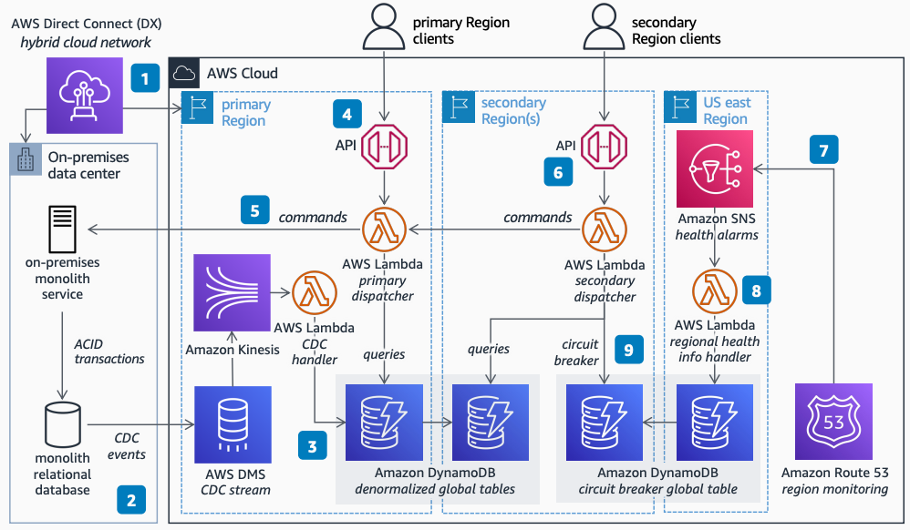

# Multi-Region CQRS for On-Premises Monoliths

Publication date: **July 1, 2022 ([Diagram history](#diagram-history "#diagram-history"))**

This architecture shows how to expand your on-premises transactional monolith to the cloud using the AWS global network. You reduce latency for end users around the world while maintaining transactional isolation, using the Command Query Responsibility Segregation (CQRS) and the read-local write-global architectural patterns.

## Multi-Region CQRS for On-Premises Monoliths

The following steps describe the architecture:

1. Deploy an AWS Direct Connect connection between your on-premises installations and the nearest AWS Region to ensure low-latency hybrid connectivity.
2. Set up a change data capture (CDC) stream from your on-premises relational database by attaching AWS Database Migration Service (AWS DMS) to the source database. Stream the events with Amazon Kinesis Data Streams.
3. Handle Kinesis CDC events with [AWS Lambda](../../../lambda/latest/dg/welcome.md "../../../lambda/latest/dg/welcome.md"), storing them in denormalized [Amazon DynamoDB](../../../amazondynamodb/latest/developerguide/Introduction.md "../../../amazondynamodb/latest/developerguide/Introduction.md") Global Tables.
4. Expose an API to your customers in the Region with Direct Connect (the primary Region), and handle query requests by reading denormalized data in DynamoDB.
5. Handle client command requests by dispatching them to the on-premises monolith service to maintain transactional isolation and atomicity.
6. Expose additional APIs in one or more secondary Regions, serving read requests with data replicated to the local DynamoDB table, and dispatching command requests to the primary Region.
7. Set up [Amazon Route 53](../../../Route53/latest/DeveloperGuide/Welcome.md "../../../Route53/latest/DeveloperGuide/Welcome.md") monitoring of your Regions in the us-east-1 Region, sending health alarms to [Amazon Simple Notification Service](../../../sns/latest/dg/welcome.md "../../../sns/latest/dg/welcome.md").
8. Handle health alarms with Lambda, storing the state and location of Regional APIs in a DynamoDB Global Table.
9. Set up circuit breakers on the API dispatchers based on the state of available Regions in DynamoDB.

## Further reading

For additional information, refer to the following resources:

- [AWS Architecture Icons](https://aws.amazon.com/architecture/icons "https://aws.amazon.com/architecture/icons")
- [AWS Architecture Center](https://aws.amazon.com/architecture "https://aws.amazon.com/architecture")
- [AWS Well-Architected](https://aws.amazon.com/architecture/well-architected "https://aws.amazon.com/architecture/well-architected")

## Diagram history

To be notified about updates to this reference architecture diagram, subscribe to the RSS feed.

| Change              | Description                                     | Date         |
| ------------------- | ----------------------------------------------- | ------------ |
| Initial publication | Reference architecture diagram first published. | July 1, 2022 |

###### Note

To subscribe to RSS updates, you must have an RSS plugin enabled for the browser you are using.
