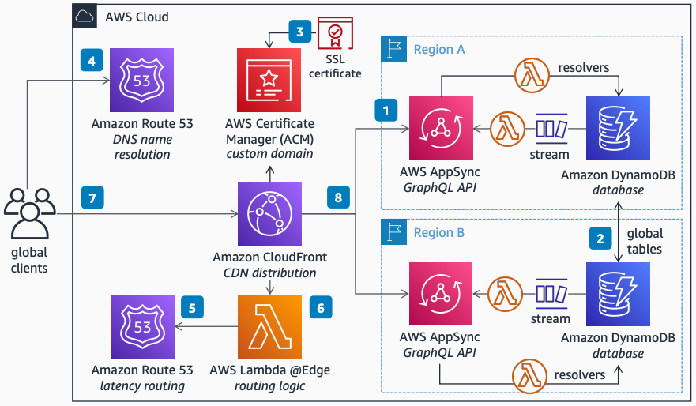

# Multi-Region GraphQL API with CloudFront

Publication date: **April 25, 2022 ([Diagram history](#diagram-history "#diagram-history"))**

This architecture shows how to reduce latency for end users while increasing your application's availability. You can provide GraphQL API endpoints in multiple AWS Regions with active/active real-time data synchronization supported by [Amazon DynamoDB](../../../amazondynamodb/latest/developerguide/Introduction.md "../../../amazondynamodb/latest/developerguide/Introduction.md") global tables.

## Multi-Region GraphQL API with CloudFront

The following steps describe the architecture:

1. Deploy a GraphQL API in two or more AWS Regions using [Amazon AppSync](../../../appsync/latest/devguide/what-is-appsync.md "../../../appsync/latest/devguide/what-is-appsync.md"), then handle the AppSync commands and queries using [AWS Lambda](../../../lambda/latest/dg/welcome.md "../../../lambda/latest/dg/welcome.md") resolvers connected to a DynamoDB database.
2. To notify clients about data changes across all Regions, enable DynamoDB global tables to keep data in sync across Regions. Handle DynamoDB data streams with a Lambda handler, triggering purposely built GraphQL schema subscriptions.
3. To support custom domains, upload the domain's SSL Certificate into AWS Certificate Manager (ACM) and attach it to an [Amazon CloudFront](../../../AmazonCloudFront/latest/DeveloperGuide/Introduction.md "../../../AmazonCloudFront/latest/DeveloperGuide/Introduction.md") distribution.
4. Point your domain name to CloudFront by using Amazon Route 53 as your DNS name resolution service.
5. Set up a routing rule on Route 53 to route your global clients to the Region with the lowest latency to their location.
6. To authenticate clients seamlessly to AppSync endpoints in any Region, use Lambda@Edge to query Route 53 for the best Region to forward the request to, and to normalize authorization by abstracting the specificities of each Regional AppSync.
7. Clients across the globe can then connect to your GraphQL API on a single endpoint available in edge locations.
8. CloudFront seamlessly routes client requests to the API in the Region with the lowest latency to the client's location.

## Further reading

For additional information, refer to the following resources:

- [AWS Architecture Icons](https://aws.amazon.com/architecture/icons "https://aws.amazon.com/architecture/icons")
- [AWS Architecture Center](https://aws.amazon.com/architecture "https://aws.amazon.com/architecture")
- [AWS Well-Architected](https://aws.amazon.com/architecture/well-architected "https://aws.amazon.com/architecture/well-architected")

## Diagram history

To be notified about updates to this reference architecture diagram, subscribe to the RSS feed.

| Change              | Description                                     | Date           |
| ------------------- | ----------------------------------------------- | -------------- |
| Initial publication | Reference architecture diagram first published. | April 25, 2022 |

###### Note

To subscribe to RSS updates, you must have an RSS plugin enabled for the browser you are using.
