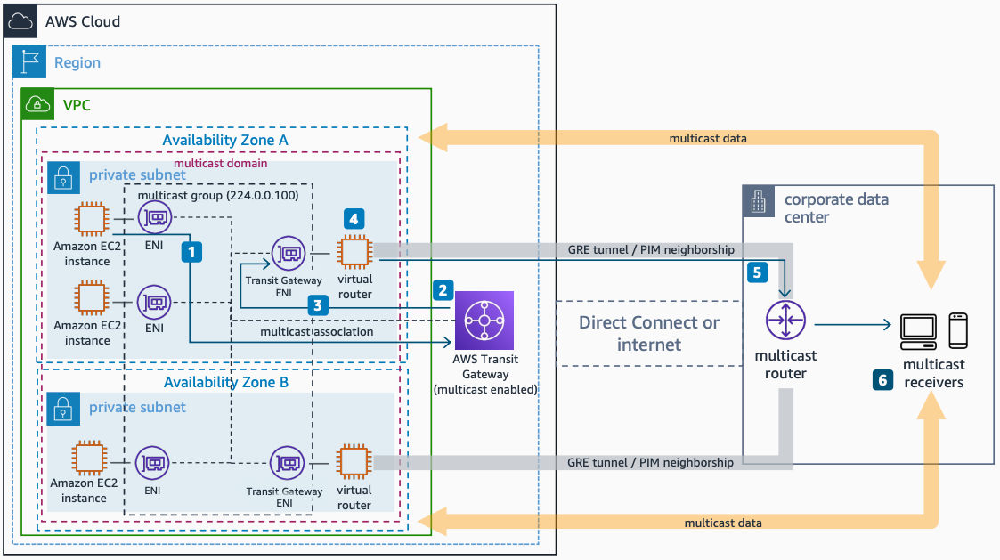

# Integrating External Multicast Services and AWS

Publication date: **May 5, 2022 ([Diagram history](#mext-diagram-history "#mext-diagram-history"))**

This architecture integrates external multicast services with AWS by deploying third-party multicast-routing-capable appliances in an [Amazon VPC](../../../vpc/latest/userguide/what-is-amazon-vpc.md "../../../vpc/latest/userguide/what-is-amazon-vpc.md"). It uses [AWS Transit Gateway](../../../vpc/latest/tgw/what-is-transit-gateway.md "../../../vpc/latest/tgw/what-is-transit-gateway.md") with multicast enabled and GRE tunnels to deliver multicast packets between AWS and the corporate data center.

## Integrating external multicast services architecture

The following steps describe the data flow in this architecture:

1. The multicast source sends traffic to a multicast group through its ENI.
2. AWS Transit Gateway with the multicast domain configuration and registered source and members forwards the packet to the virtual router.
3. The virtual router deployed in the Amazon VPC receives the multicast packets.
4. The virtual routers deliver the multicast packets between network segments using Protocol Independent Multicast (PIM). The packets forward through a Generic Routing Encapsulation (GRE) tunnel between the virtual routers in AWS and the multicast router in the corporate data center.
5. The on-premises router receives packets through the tunnel and decapsulates them.
6. Decapsulated packets send over the downstream multicast interface to the receivers.

For more information about integrating external multicast services with AWS, see [Integrating external multicast services with AWS](https://aws.amazon.com/blogs/networking-and-content-delivery/integrating-external-multicast-services-with-aws/ "https://aws.amazon.com/blogs/networking-and-content-delivery/integrating-external-multicast-services-with-aws/").

## Further reading

For additional information, see the following resources:

- [AWS Architecture Icons](https://aws.amazon.com/architecture/icons "https://aws.amazon.com/architecture/icons")
- [AWS Architecture Center](https://aws.amazon.com/architecture "https://aws.amazon.com/architecture")
- [AWS Well-Architected](https://aws.amazon.com/architecture/well-architected "https://aws.amazon.com/architecture/well-architected")

## Diagram history

To be notified about updates to this reference architecture diagram, subscribe to the RSS feed.

| Change                                                                                                                       | Description                                     | Date        |
| ---------------------------------------------------------------------------------------------------------------------------- | ----------------------------------------------- | ----------- |
| [Initial publication](multicast-single-vpc.md#msvpc-diagram-history "multicast-single-vpc.md#msvpc-diagram-history")         | Reference architecture diagram first published. | May 5, 2022 |
| [Initial publication](multicast-multi-account.md#mmulti-diagram-history "multicast-multi-account.md#mmulti-diagram-history") | Reference architecture diagram first published. | May 5, 2022 |
| Initial publication                                                                                                          | Reference architecture diagram first published. | May 5, 2022 |

###### Note

To subscribe to RSS updates, you must have an RSS plugin enabled for the browser you are using.
