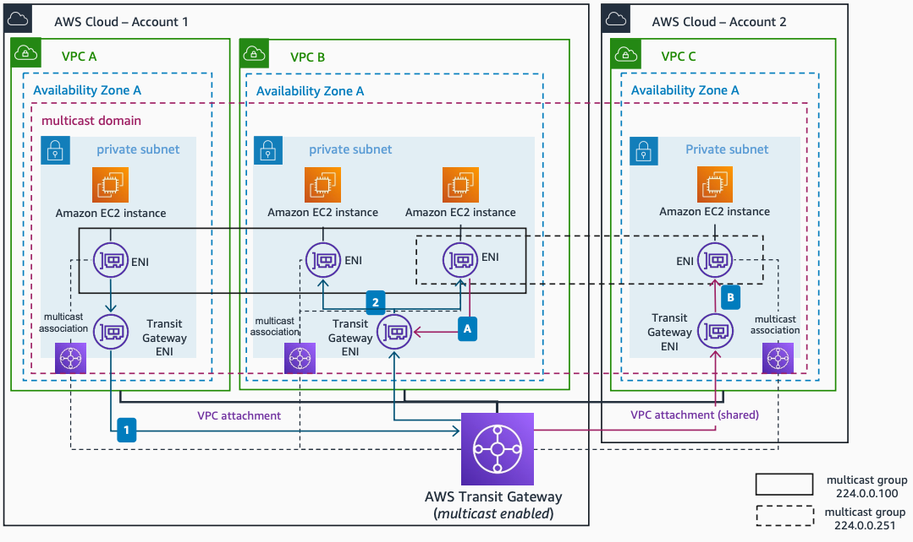

# Multicast Traffic in Multi-Account Environments

Publication date: **May 5, 2022 ([Diagram history](#mmulti-diagram-history "#mmulti-diagram-history"))**

This architecture uses [AWS Resource Access Manager (RAM)](../../../ram/latest/userguide/what-is.md "../../../ram/latest/userguide/what-is.md") to share multicast domains to other AWS accounts. Consumers can associate or disassociate subnets to the multicast domain and register or deregister group members or sources.

## Multicast traffic in multi-account environments architecture

The following steps describe the data flow in this architecture:

1. All subnets in VPCs from both accounts associate to the multicast domain. Instances in **Account 1** VPCs use the **224.0.0.100** multicast group. Those instances use IGMP to dynamically join, leave, and send messages within the group.
2. Any multicast message sent by any instance in the group reaches all other members, using AWS Transit Gateway as the multicast router.

For cross-account communication:

1. The Amazon EC2 instance in **Account 2** VPC joins the multicast group **224.0.0.251** using a static source group membership configuration. It can only receive traffic in this mode.
2. An instance in **VPC B** sends multicast traffic to the **224.0.0.251** group using AWS Transit Gateway as the multicast router. If IGMPv2 is enabled for the domain, any Nitro instance can also send traffic.

For more information about using IGMP to join multicast groups, see [Automating service discovery using AWS Transit Gateway Multicast with IGMP](https://aws.amazon.com/blogs/networking-and-content-delivery/automating-service-discovery-using-aws-transit-gateway-multicast-with-igmp/ "https://aws.amazon.com/blogs/networking-and-content-delivery/automating-service-discovery-using-aws-transit-gateway-multicast-with-igmp/").

## Further reading

For additional information, see the following resources:

- [AWS Architecture Icons](https://aws.amazon.com/architecture/icons "https://aws.amazon.com/architecture/icons")
- [AWS Architecture Center](https://aws.amazon.com/architecture "https://aws.amazon.com/architecture")
- [AWS Well-Architected](https://aws.amazon.com/architecture/well-architected "https://aws.amazon.com/architecture/well-architected")

## Diagram history

To be notified about updates to this reference architecture diagram, subscribe to the RSS feed.

| Change                                                                                                                                 | Description                                     | Date        |
| -------------------------------------------------------------------------------------------------------------------------------------- | ----------------------------------------------- | ----------- |
| [Initial publication](multicast-single-vpc.md#msvpc-diagram-history "multicast-single-vpc.md#msvpc-diagram-history")                   | Reference architecture diagram first published. | May 5, 2022 |
| Initial publication                                                                                                                    | Reference architecture diagram first published. | May 5, 2022 |
| [Initial publication](multicast-external-integration.md#mext-diagram-history "multicast-external-integration.md#mext-diagram-history") | Reference architecture diagram first published. | May 5, 2022 |

###### Note

To subscribe to RSS updates, you must have an RSS plugin enabled for the browser you are using.
