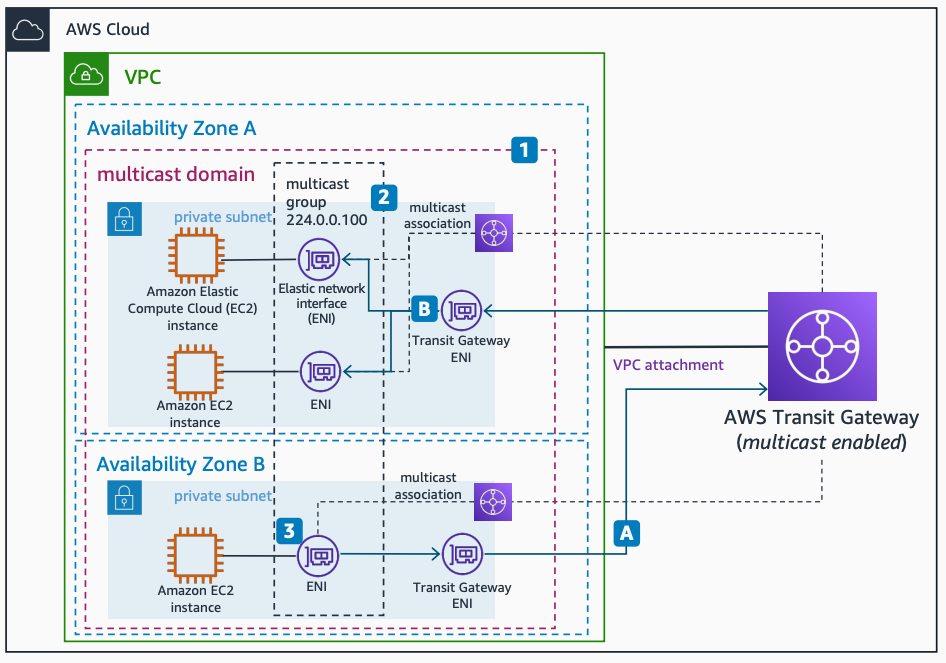

# Multicast Traffic in a Single VPC

Publication date: **May 5, 2022 ([Diagram history](#msvpc-diagram-history "#msvpc-diagram-history"))**

This architecture uses [AWS Transit Gateway](../../../vpc/latest/tgw/what-is-transit-gateway.md "../../../vpc/latest/tgw/what-is-transit-gateway.md") with multicast enabled to build multicast applications in a single Amazon VPC. You achieve segmentation by creating [multicast domains](../../../vpc/latest/tgw/tgw-multicast-overview.md "../../../vpc/latest/tgw/tgw-multicast-overview.md") that define which subnets participate in multicast communication.

## Multicast traffic in a single VPC architecture

The following steps describe the configuration and data flow in this architecture:

1. A multicast domain defines the subnets that participate in multicast communication. Multicast association (domain membership) operates at the subnet level, and a single subnet can only associate with one multicast domain.
2. A multicast group defines the hosts that send or receive the same multicast traffic. You define multiple groups within the same multicast domain. A group IP address identifies each group, and individual ENIs define membership.

The following steps describe the data flow:

1. An ENI associated with a supported Amazon EC2 instance receives multicast traffic by being a multicast group member. Nitro instances can send and receive traffic in a static source group membership configuration. With IGMPv2 enabled, any Nitro instance can send traffic without static configuration.
2. An Amazon EC2 instance in Availability Zone B sends a multicast packet using the multicast group IP address 224.0.0.100.
3. The packet arrives at AWS Transit Gateway, which redirects it to the other instances in the same group located in Availability Zone A.

For more information about multicast on AWS Transit Gateway, see [Multicast on transit gateways](../../../vpc/latest/tgw/tgw-multicast-overview.md "../../../vpc/latest/tgw/tgw-multicast-overview.md").

For more information about Nitro instances, see [Instances built on the Nitro System](../../../AWSEC2/latest/UserGuide/instance-types.md "../../../AWSEC2/latest/UserGuide/instance-types.md").

## Further reading

For additional information, see the following resources:

- [AWS Architecture Icons](https://aws.amazon.com/architecture/icons "https://aws.amazon.com/architecture/icons")
- [AWS Architecture Center](https://aws.amazon.com/architecture "https://aws.amazon.com/architecture")
- [AWS Well-Architected](https://aws.amazon.com/architecture/well-architected "https://aws.amazon.com/architecture/well-architected")

## Diagram history

To be notified about updates to this reference architecture diagram, subscribe to the RSS feed.

| Change                                                                                                                                 | Description                                     | Date        |
| -------------------------------------------------------------------------------------------------------------------------------------- | ----------------------------------------------- | ----------- |
| Initial publication                                                                                                                    | Reference architecture diagram first published. | May 5, 2022 |
| [Initial publication](multicast-multi-account.md#mmulti-diagram-history "multicast-multi-account.md#mmulti-diagram-history")           | Reference architecture diagram first published. | May 5, 2022 |
| [Initial publication](multicast-external-integration.md#mext-diagram-history "multicast-external-integration.md#mext-diagram-history") | Reference architecture diagram first published. | May 5, 2022 |

###### Note

To subscribe to RSS updates, you must have an RSS plugin enabled for the browser you are using.
