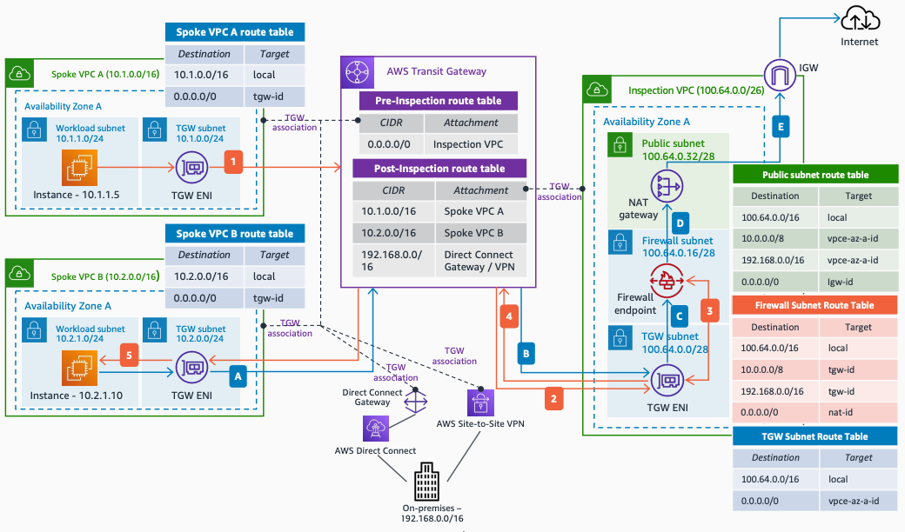

# Combined Inspection with AWS Network Firewall and AWS Transit Gateway

Publication date: **March 16, 2022 ([Diagram history](#nwfw5-diagram-history "#nwfw5-diagram-history"))**

This architecture shows how to use [AWS Transit Gateway](../../../vpc/latest/tgw/what-is-transit-gateway.md "../../../vpc/latest/tgw/what-is-transit-gateway.md") to centralize the east-west inspection between VPCs, while having a NAT gateway in the Inspection Amazon VPC for centralized egress and north-south inspection using [AWS Network Firewall](../../../network-firewall/latest/developerguide/what-is-aws-network-firewall.md "../../../network-firewall/latest/developerguide/what-is-aws-network-firewall.md").

## Combined inspection with Network Firewall architecture

The following steps describe the east-west traffic flow in this architecture:

1. Traffic from an instance in **Spoke VPC A** destined to another instance in **Spoke VPC B** (east-west traffic) is routed to the Transit Gateway.
2. The Transit Gateway route table associated with the attachment sends all the traffic (**0.0.0.0/0**) to the **Inspection VPC**.
3. The **Inspection VPC** **TGW subnet** route table sends all the traffic to the firewall endpoint. The allowed traffic is forwarded back to the TGW ENI.
4. As per the Transit Gateway route table associated with the **Inspection VPC**, the traffic is sent to **Spoke VPC B**.
5. Finally, in the **TGW subnet** route table of **Spoke VPC B**, the traffic is sent to the destination.

The following steps describe the north-south traffic flow:

1. Traffic from an instance in **Spoke VPC B** destined to the internet (north-south traffic) is routed to the Transit Gateway.
2. The Transit Gateway route table associated with the attachment sends all the traffic (**0.0.0.0/0**) to the **Inspection VPC**, same as in the previous example.
3. The **Inspection VPC** **TGW subnet** route table sends all the traffic to the firewall endpoint, where it is transparently analyzed.
4. Allowed traffic is sent to the NAT gateway as per the **Firewall subnet** route table.
5. The private IP of the client is translated to the private IP of the NAT gateway, and in turn, translated to the public IP by the internet gateway.

###### Note

It is recommended to use Transit Gateway appliance mode in the **Inspection VPC** Transit Gateway attachment to maintain flow symmetry.

For an example of this architecture in Terraform, see [AWS Hub and Spoke Architecture with an Inspection VPC](https://github.com/aws-ia/terraform-aws-network-hubandspoke "https://github.com/aws-ia/terraform-aws-network-hubandspoke") on GitHub.

## Further reading

For additional information, see the following resources:

- [AWS Architecture Icons](https://aws.amazon.com/architecture/icons "https://aws.amazon.com/architecture/icons")
- [AWS Architecture Center](https://aws.amazon.com/architecture "https://aws.amazon.com/architecture")
- [AWS Well-Architected](https://aws.amazon.com/architecture/well-architected "https://aws.amazon.com/architecture/well-architected")

## Diagram history

To be notified about updates to this reference architecture diagram, subscribe to the RSS feed.

| Change                                                                                                         | Description                                     | Date           |
| -------------------------------------------------------------------------------------------------------------- | ----------------------------------------------- | -------------- |
| [Initial publication](nwfw-single-vpc.md#nwfw1-diagram-history "nwfw-single-vpc.md#nwfw1-diagram-history")     | Reference architecture diagram first published. | March 16, 2022 |
| [Initial publication](nwfw-intra-vpc.md#nwfw2-diagram-history "nwfw-intra-vpc.md#nwfw2-diagram-history")       | Reference architecture diagram first published. | March 16, 2022 |
| [Initial publication](nwfw-east-west.md#nwfw3-diagram-history "nwfw-east-west.md#nwfw3-diagram-history")       | Reference architecture diagram first published. | March 16, 2022 |
| [Initial publication](nwfw-north-south.md#nwfw4-diagram-history "nwfw-north-south.md#nwfw4-diagram-history")   | Reference architecture diagram first published. | March 16, 2022 |
| Initial publication                                                                                            | Reference architecture diagram first published. | March 16, 2022 |
| [Initial publication](nwfw-multi-region.md#nwfw6-diagram-history "nwfw-multi-region.md#nwfw6-diagram-history") | Reference architecture diagram first published. | March 16, 2022 |

###### Note

To subscribe to RSS updates, you must have an RSS plugin enabled for the browser you are using.
