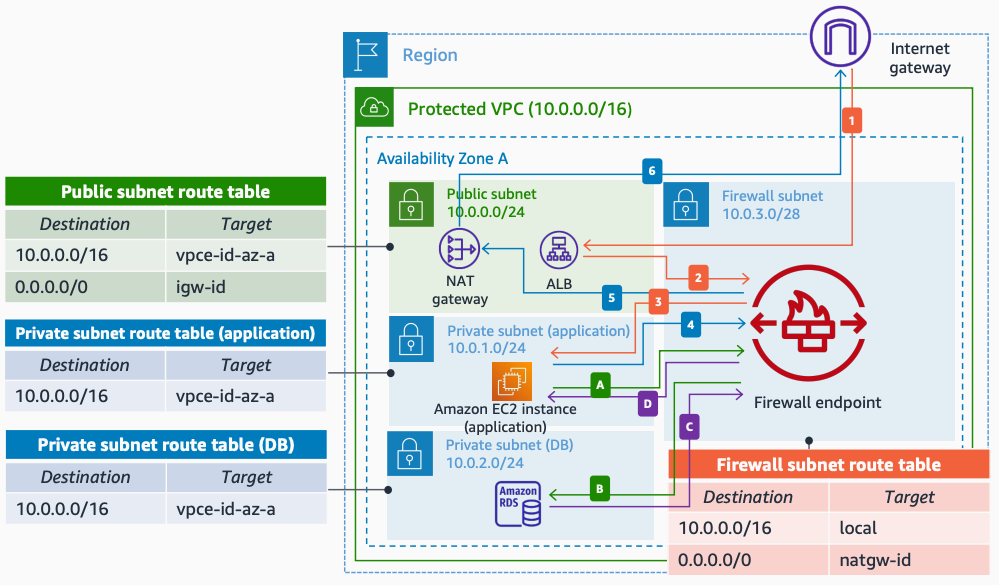

# Intra-VPC Inspection with AWS Network Firewall

Publication date: **March 16, 2022 ([Diagram history](#nwfw2-diagram-history "#nwfw2-diagram-history"))**

This architecture shows how to use the Amazon VPC routing enhancement to inspect intra-VPC traffic (between subnets of the same Amazon VPC) using [AWS Network Firewall](../../../network-firewall/latest/developerguide/what-is-aws-network-firewall.md "../../../network-firewall/latest/developerguide/what-is-aws-network-firewall.md"). With Amazon VPC routing enhancement, any traffic between private subnets in the Amazon VPC can be first sent to the firewall endpoint to inspect the traffic.

## Intra-VPC inspection with Network Firewall architecture

The following numbered items describe the key components in this architecture:

1. Ingress traffic is routed directly to a public workload: web servers or a load balancer.
2. Traffic between the public subnet and the application servers is inspected. It is recommended that you place the firewall endpoint in its own subnet ("**Firewall subnet**").
3. When the inspection is done, allowed traffic is routed to the application servers.
4. With Amazon VPC routing enhancement, any traffic between private subnets in the Amazon VPC can be first sent to the firewall endpoint to inspect the traffic.
5. You can add a more specific classless inter-domain routing (CIDR) block than the default block in the routing tables to select which intra-VPC traffic is inspected.
6. Outbound traffic to the internet from the application servers: the packets are first sent to the firewall endpoint, and the allowed traffic goes to the load balancer, web servers, or NAT gateway before being sent to the internet.

For more information about Multi-AZ options or connectivity options using AWS Transit Gateway, see [Deployment models for AWS Network Firewall with VPC routing enhancements](https://aws.amazon.com/blogs/networking-and-content-delivery/deployment-models-for-aws-network-firewall-with-vpc-routing-enhancements/ "https://aws.amazon.com/blogs/networking-and-content-delivery/deployment-models-for-aws-network-firewall-with-vpc-routing-enhancements/") on the AWS Blog.

## Further reading

For additional information, see the following resources:

- [AWS Architecture Icons](https://aws.amazon.com/architecture/icons "https://aws.amazon.com/architecture/icons")
- [AWS Architecture Center](https://aws.amazon.com/architecture "https://aws.amazon.com/architecture")
- [AWS Well-Architected](https://aws.amazon.com/architecture/well-architected "https://aws.amazon.com/architecture/well-architected")

## Diagram history

To be notified about updates to this reference architecture diagram, subscribe to the RSS feed.

| Change                                                                                                         | Description                                     | Date           |
| -------------------------------------------------------------------------------------------------------------- | ----------------------------------------------- | -------------- |
| [Initial publication](nwfw-single-vpc.md#nwfw1-diagram-history "nwfw-single-vpc.md#nwfw1-diagram-history")     | Reference architecture diagram first published. | March 16, 2022 |
| Initial publication                                                                                            | Reference architecture diagram first published. | March 16, 2022 |
| [Initial publication](nwfw-east-west.md#nwfw3-diagram-history "nwfw-east-west.md#nwfw3-diagram-history")       | Reference architecture diagram first published. | March 16, 2022 |
| [Initial publication](nwfw-north-south.md#nwfw4-diagram-history "nwfw-north-south.md#nwfw4-diagram-history")   | Reference architecture diagram first published. | March 16, 2022 |
| [Initial publication](nwfw-combined.md#nwfw5-diagram-history "nwfw-combined.md#nwfw5-diagram-history")         | Reference architecture diagram first published. | March 16, 2022 |
| [Initial publication](nwfw-multi-region.md#nwfw6-diagram-history "nwfw-multi-region.md#nwfw6-diagram-history") | Reference architecture diagram first published. | March 16, 2022 |

###### Note

To subscribe to RSS updates, you must have an RSS plugin enabled for the browser you are using.
