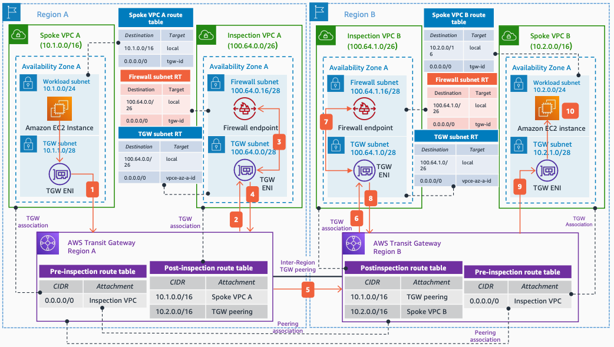

# Multi-Region Inspection with AWS Network Firewall and AWS Transit Gateway

Publication date: **March 16, 2022 ([Diagram history](#nwfw6-diagram-history "#nwfw6-diagram-history"))**

This architecture shows how to inspect traffic in each AWS Region when using [AWS Transit Gateway](../../../vpc/latest/tgw/what-is-transit-gateway.md "../../../vpc/latest/tgw/what-is-transit-gateway.md") to centralize your inspection and inter-Region peering between two AWS Regions. Inspecting traffic in each Region is a best practice to avoid asymmetric traffic.

## Multi-Region centralized inspection with Network Firewall architecture

The following numbered items describe the traffic flow in this architecture:

1. Traffic from an instance in **Spoke VPC A** destined to another instance in **Spoke VPC B** is routed to the Transit Gateway in Region A as per the **Spoke VPC A** route table.
2. The Transit Gateway (Region A) route table associated with the attachment (**Pre-inspection route table**) sends all the traffic (**0.0.0.0/0**) to the **Inspection VPC A**.
3. The **Inspection VPC A** **TGW subnet** route table sends all the traffic to the firewall endpoint for transparent inspection.
4. The allowed traffic is forwarded back to the TGW ENI.
5. As per the Transit Gateway (Region A) route table associated with the **Inspection VPC A** (**Post-inspection route table**), the traffic is sent to Region B through the Transit Gateway peering.
6. As per the Transit Gateway (Region B) route table associated with the Transit Gateway peering (**Pre-inspection route table**), the traffic is sent to the **Inspection VPC B** for inspection.
7. The **Inspection VPC B** **TGW subnet** route table sends all the traffic to the firewall endpoint for transparent inspection.
8. The allowed traffic is forwarded back to the TGW ENI.
9. As per the Transit Gateway (Region B) route table associated with the **Inspection VPC B** (**Post-inspection route table**), the traffic is sent to **Spoke VPC B**.
10. Traffic is forwarded to the destination, the Amazon Elastic Compute Cloud instance in **Spoke VPC B**.

###### Note

It is recommended to use Transit Gateway appliance mode in the **Inspection VPC** Transit Gateway attachments to maintain flow symmetry.

## Further reading

For additional information, see the following resources:

- [AWS Architecture Icons](https://aws.amazon.com/architecture/icons "https://aws.amazon.com/architecture/icons")
- [AWS Architecture Center](https://aws.amazon.com/architecture "https://aws.amazon.com/architecture")
- [AWS Well-Architected](https://aws.amazon.com/architecture/well-architected "https://aws.amazon.com/architecture/well-architected")

## Diagram history

To be notified about updates to this reference architecture diagram, subscribe to the RSS feed.

| Change                                                                                                       | Description                                     | Date           |
| ------------------------------------------------------------------------------------------------------------ | ----------------------------------------------- | -------------- |
| [Initial publication](nwfw-single-vpc.md#nwfw1-diagram-history "nwfw-single-vpc.md#nwfw1-diagram-history")   | Reference architecture diagram first published. | March 16, 2022 |
| [Initial publication](nwfw-intra-vpc.md#nwfw2-diagram-history "nwfw-intra-vpc.md#nwfw2-diagram-history")     | Reference architecture diagram first published. | March 16, 2022 |
| [Initial publication](nwfw-east-west.md#nwfw3-diagram-history "nwfw-east-west.md#nwfw3-diagram-history")     | Reference architecture diagram first published. | March 16, 2022 |
| [Initial publication](nwfw-north-south.md#nwfw4-diagram-history "nwfw-north-south.md#nwfw4-diagram-history") | Reference architecture diagram first published. | March 16, 2022 |
| [Initial publication](nwfw-combined.md#nwfw5-diagram-history "nwfw-combined.md#nwfw5-diagram-history")       | Reference architecture diagram first published. | March 16, 2022 |
| Initial publication                                                                                          | Reference architecture diagram first published. | March 16, 2022 |

###### Note

To subscribe to RSS updates, you must have an RSS plugin enabled for the browser you are using.
