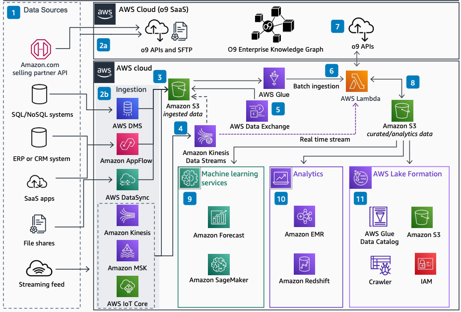

# o9 Demand Planning for CPG

Publication date: **July 8, 2022 ([Diagram history](#o9-history "#o9-history"))**

With this architecture, you can review options for ingesting data and using AWS services
in an o9 demand planning solution. Consumer packaged goods (CPG) companies
ingest data from SQL and NoSQL systems, enterprise resource planning (ERP) or customer
relationship management (CRM) systems, SaaS applications, and streaming sources.

## o9 demand planning diagram

The following steps describe the architecture:

1. SQL and NoSQL systems, ERP or CRM systems, SaaS applications, file shares, and
   streaming sources feed data into demand planning. An Amazon.com Selling
   Partner API provides access to vendor sales orders and product catalogs.
2. Data can be ingested into the o9 SaaS solution by using native
   o9 APIs and SSH File Transfer Protocol (SFTP). Alternatively, data can
   be ingested into an AWS account. You use [AWS Database Migration Service](../../../dms/latest/userguide.md "../../../dms/latest/userguide.md") for SQL and NoSQL, [Amazon AppFlow](../../../appflow/latest/userguide.md "../../../appflow/latest/userguide.md") for ERP, CRM,
   or SaaS, or [Kinesis](../../../kinesis/latest/dev.md "../../../kinesis/latest/dev.md") for streaming data.
3. [Amazon Simple Storage Service (Amazon S3)](../../../AmazonS3/latest/userguide.md "../../../AmazonS3/latest/userguide.md") stores the ingested
   data.
4. Streaming data can also be fed to the o9 SaaS solution by using
   native REST APIs. Alternatively, store it in Amazon S3 by using Kinesis Data Streams through
   an AWS SDK or Lambda.
5. Third-party data from providers such as TransUnion or
   Reuters can be imported by using AWS Data Exchange.
6. AWS customer account data in Amazon S3 can be batch-ingested into the o9
   SaaS solution by using [AWS Glue](../../../glue/latest/dg.md "../../../glue/latest/dg.md") through an AWS SDK or Lambda.
7. Data within the o9 SaaS solution and AWS customer account are
   shared by using native o9 APIs and optionally Lambda.
8. Outbound data is collected from the o9 SaaS solution in Amazon S3. You
   use this data for analytics and artificial intelligence and machine learning (AI/ML)
   workloads.
9. AWS AI/ML services such as [Amazon Forecast](../../../forecast/latest/dg.md "../../../forecast/latest/dg.md") and [Amazon SageMaker AI](../../../sagemaker/latest/dg.md "../../../sagemaker/latest/dg.md") build, train, and deploy ML models.
   These complement o9 SaaS solution ML capabilities.
10. AWS analytics services such as Amazon EMR and Amazon Redshift provide big data processing and
    warehousing.
11. You can integrate data from the o9 SaaS solution to an AWS data
    lake. [AWS Lake Formation](../../../lake-formation/latest/dg.md "../../../lake-formation/latest/dg.md") provides governance with Amazon S3,
    AWS Glue Data Catalog, and IAM for permissions.

## Further reading

For additional information, see the following resources:

- [AWS Architecture Icons](https://aws.amazon.com/architecture/icons "https://aws.amazon.com/architecture/icons")
- [AWS Architecture Center](https://aws.amazon.com/architecture/ "https://aws.amazon.com/architecture/")
- [AWS Well-Architected](https://aws.amazon.com/architecture/well-architected "https://aws.amazon.com/architecture/well-architected")

## Diagram history

To receive updates about this reference architecture diagram, subscribe to the RSS
feed.

| Change              | Description                                     | Date         |
| ------------------- | ----------------------------------------------- | ------------ |
| Initial publication | Reference architecture diagram first published. | July 8, 2022 |

###### RSS subscription requirement

To subscribe to RSS updates, you must have an RSS plugin enabled for the browser you
are using.
