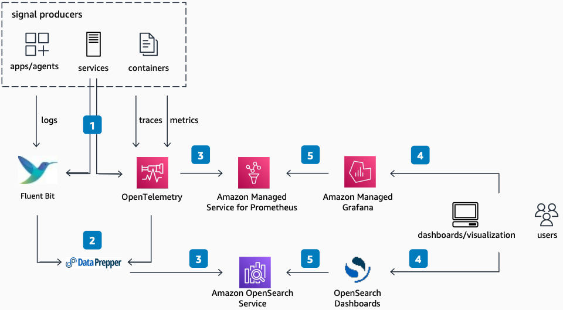

# Observability with Logs, Traces, and Metrics

Publication date: **November 15, 2022 ([Diagram history](#diagram-history "#diagram-history"))**

This architecture shows how to use for application performance monitoring and infrastructure observability.

## Observability with Logs, Traces, and Metrics

1. Applications, services, and containers produce three types of signals: logs, metrics, and traces.
2. Collectors such as Fluent Bit and Data Prepper transform and enrich these signals.
3. The collectors forward the data to different data stores. [https://docs.aws.amazon.com/opensearch-service/latest/developerguide/what-is.html](../../../opensearch-service/latest/developerguide/what-is.md "../../../opensearch-service/latest/developerguide/what-is.md") stores traces and logs received from OpenSearch Data Prepper. Amazon Managed Service for Prometheus stores metrics received from AWS Distro for OpenTelemetry metric scrapers.
4. Users create interactive dashboards and visualizations with this signal data. They use tools such as Amazon OpenSearch Dashboards and Amazon Managed Grafana.
5. These visualization tools use data stored in and Amazon Managed Service for Prometheus to present information.

## Further reading

For additional information, refer to

- [AWS Architecture Icons](https://aws.amazon.com/architecture/icons "https://aws.amazon.com/architecture/icons")
- [AWS Architecture Center](https://aws.amazon.com/architecture "https://aws.amazon.com/architecture")
- [AWS Well-Architected](https://aws.amazon.com/architecture/well-architected "https://aws.amazon.com/architecture/well-architected")
- [product page](https://aws.amazon.com/opensearch-service/ "https://aws.amazon.com/opensearch-service/")

## Diagram history

To be notified about updates to this reference architecture diagram, subscribe to the RSS feed.

| Change              | Description                                     | Date              |
| ------------------- | ----------------------------------------------- | ----------------- |
| Initial publication | Reference architecture diagram first published. | November 15, 2022 |

###### Note

To subscribe to RSS updates, you must have an RSS plugin enabled for the browser you are using.
