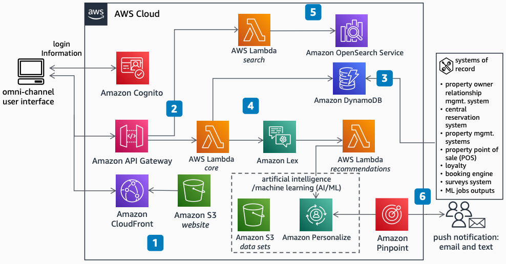

# Omni-channel Customer Engagement for Lodging

Publication date: **August 15, 2022 ([Diagram history](#oce-history "#oce-history"))**

With this architecture, you can provide a unified interface for customer service teams at
travel and hospitality companies. Deliver personalized service across all channels at every
stage of the guest journey. The solution uses [Amazon Lex](../../../lexv2/latest/dg.md "../../../lexv2/latest/dg.md") for chatbot interactions, [Amazon OpenSearch Service](../../../opensearch-service/latest/developerguide.md "../../../opensearch-service/latest/developerguide.md") for
product search, and [Amazon Pinpoint](../../../pinpoint/latest/userguide.md "../../../pinpoint/latest/userguide.md") for notifications.

## Omni-channel customer engagement diagram

The following steps describe the architecture:

1. Use [Amazon Simple Storage Service](../../../AmazonS3/latest/userguide.md "../../../AmazonS3/latest/userguide.md") to store website and configuration
   files. Serve the unified user interface through [Amazon CloudFront](../../../AmazonCloudFront/latest/DeveloperGuide.md "../../../AmazonCloudFront/latest/DeveloperGuide.md").
2. Invoke [AWS Lambda](../../../lambda/latest/dg.md "../../../lambda/latest/dg.md") to
   provide personalized recommendations for guests through [Amazon API Gateway](../../../apigateway/latest/developerguide.md "../../../apigateway/latest/developerguide.md"). Control API access through
   [Amazon Cognito](../../../cognito/latest/developerguide.md "../../../cognito/latest/developerguide.md").
3. Run a serverless database architecture on [Amazon DynamoDB](../../../amazondynamodb/latest/developerguide.md "../../../amazondynamodb/latest/developerguide.md"). Collect key guest
   360-degree data from several sources, including data processing workload outputs and
   systems of record.
4. Use a chatbot powered by Amazon Lex to collect guest input data. Automate the delivery of
   personalized user interactions and recommendations.
5. Use a search service powered by Amazon OpenSearch Service to recommend available products in the data
   bank index.
6. Use Amazon Pinpoint to send recommendations to guests through email or mobile push
   notifications. Schedule the notifications based on guest preferences.

## Further reading

For additional information, see the following resources:

- [AWS Architecture
  Icons](https://aws.amazon.com/architecture/icons "https://aws.amazon.com/architecture/icons")
- [AWS Architecture Center](https://aws.amazon.com/architecture/ "https://aws.amazon.com/architecture/")
- [AWS
  Well-Architected](https://aws.amazon.com/architecture/well-architected "https://aws.amazon.com/architecture/well-architected")

## Diagram history

To receive updates about this reference architecture diagram, subscribe to the RSS
feed.

| Change              | Description                                     | Date            |
| ------------------- | ----------------------------------------------- | --------------- |
| Initial publication | Reference architecture diagram first published. | August 15, 2022 |

###### RSS subscription requirement

To subscribe to RSS updates, you must have an RSS plugin enabled for the browser you
are using.
