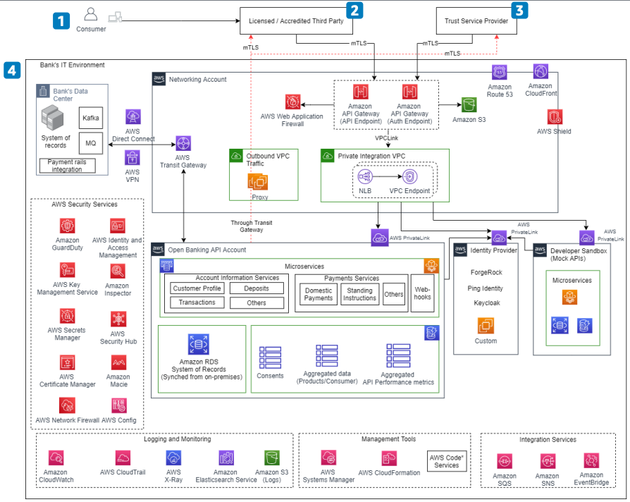

# Open Banking on AWS: Overview

Publication date: **September 7, 2021 ([Diagram history](#ob-overview-history "#ob-overview-history"))**

With this architecture, you can open APIs for authorized third parties and implement Open
Banking regulations. Third parties access consumer data (account balances, transactions,
statements) or initiate payment submissions with customer consent. This supports use cases such
as spend analysis, credit decisioning, and ecommerce payments.

## Open Banking overview diagram

The following steps describe the Open Banking ecosystem participants:

1. Access the licensed or accredited third-party application and provide consent for
   the third party to access consumer data or initiate a payment submission request.
2. Use third parties as authorized institutions that provide value-added services on top
   of regular banking needs (accounts information, payments). This approach supports use cases
   such as spend analysis, credit decisioning, and ecommerce payments.
3. Validate the authenticity of banks and third parties through a Trust Service Provider
   (TSP) authorized by a supervisory government body. The TSP issues digital certificates to
   third parties.
4. Connect the bank IT environment, including AWS and data center
   components.

## Further reading

For additional information, see the following resources:

- [AWS Architecture Icons](https://aws.amazon.com/architecture/icons "https://aws.amazon.com/architecture/icons")
- [AWS Architecture Center](https://aws.amazon.com/architecture/ "https://aws.amazon.com/architecture/")
- [AWS
  Well-Architected](https://aws.amazon.com/architecture/well-architected "https://aws.amazon.com/architecture/well-architected")

## Diagram history

To receive updates about this reference architecture diagram, subscribe to the RSS
feed.

| Change                                                                                           | Description                                     | Date              |
| ------------------------------------------------------------------------------------------------ | ----------------------------------------------- | ----------------- |
| Initial publication                                                                              | Reference architecture diagram first published. | September 7, 2021 |
| [Initial publication](open-banking-part1.md#ob-p1-history "open-banking-part1.md#ob-p1-history") | Reference architecture diagram first published. | September 7, 2021 |
| [Initial publication](open-banking-part2.md#ob-p2-history "open-banking-part2.md#ob-p2-history") | Reference architecture diagram first published. | September 7, 2021 |

###### RSS subscription requirement

To subscribe to RSS updates, you must have an RSS plugin enabled for the browser you are
using.
