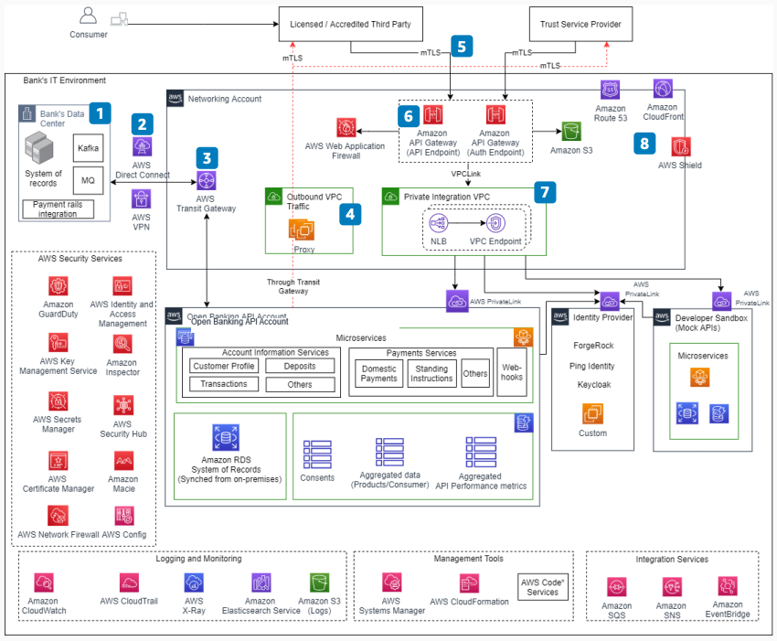

# Open Banking on AWS: Networking and security

Publication date: **September 7, 2021 ([Diagram history](#ob-p1-history "#ob-p1-history"))**

With this architecture, you can connect on-premises core banking systems to AWS and
expose Open Banking APIs securely. The solution uses [AWS Direct Connect](../../../directconnect/latest/UserGuide.md "../../../directconnect/latest/UserGuide.md") for connectivity, [AWS Transit Gateway](../../../vpc/latest/tgw.md "../../../vpc/latest/tgw.md") for network hub management,
and [Amazon API Gateway](../../../apigateway/latest/developerguide.md "../../../apigateway/latest/developerguide.md") for
API management with [AWS WAF](../../../waf/latest/developerguide.md "../../../waf/latest/developerguide.md") integration.

## Open Banking networking and security diagram

The following steps describe the networking and security components for this
architecture:

1. Send and receive all new and updated transactions between core banking systems and
   AWS by using streaming technologies such as Apache Kafka and message
   queue (MQ) mechanisms.
2. Connect the bank data center to AWS by using a combination of AWS Direct Connect and
   [AWS Site-to-Site VPN](../../../vpn/latest/s2svpn.md "../../../vpn/latest/s2svpn.md"). Use two diverse
   AWS Direct Connect connections for maximum resiliency.
3. Use AWS Transit Gateway as the central hub on AWS to manage interconnectivity between
   workloads running in different AWS accounts. Share the AWS Direct Connect and VPN
   connection with other workloads in the bank.
4. Provide secure outbound access from an outbound Amazon VPC through a proxy.
5. Authenticate accredited third parties and provide access tokens through mutual TLS
   (mTLS) for transport layer security.
6. Expose Open Banking APIs and Authorization APIs through Amazon API Gateway. Integrate AWS WAF
   with Amazon API Gateway for web protection.
7. Store public certificates of clients in [Amazon Simple Storage Service](../../../AmazonS3/latest/userguide.md "../../../AmazonS3/latest/userguide.md") as a trust store for validating
   requests. Validate the authenticity of third parties against a Trust Service Provider
   (TSP).
8. Connect Amazon API Gateway to the private subnets hosting microservices in other AWS
   accounts through a private integration Amazon VPC and AWS PrivateLink.
9. Provide traffic management and domain name resolution by using [Amazon Route 53](../../../Route53/latest/DeveloperGuide.md "../../../Route53/latest/DeveloperGuide.md"). Deliver
   static data through [Amazon CloudFront](../../../AmazonCloudFront/latest/DeveloperGuide.md "../../../AmazonCloudFront/latest/DeveloperGuide.md") with [AWS Shield](../../../waf/latest/developerguide/shield-chapter.md "../../../waf/latest/developerguide/shield-chapter.md")
   protection.

## Further reading

For additional information, see the following resources:

- [AWS Architecture Icons](https://aws.amazon.com/architecture/icons "https://aws.amazon.com/architecture/icons")
- [AWS Architecture Center](https://aws.amazon.com/architecture/ "https://aws.amazon.com/architecture/")
- [AWS
  Well-Architected](https://aws.amazon.com/architecture/well-architected "https://aws.amazon.com/architecture/well-architected")

## Diagram history

To receive updates about this reference architecture diagram, subscribe to the RSS
feed.

| Change                                                                                                             | Description                                     | Date              |
| ------------------------------------------------------------------------------------------------------------------ | ----------------------------------------------- | ----------------- |
| [Initial publication](open-banking-overview.md#ob-overview-history "open-banking-overview.md#ob-overview-history") | Reference architecture diagram first published. | September 7, 2021 |
| Initial publication                                                                                                | Reference architecture diagram first published. | September 7, 2021 |
| [Initial publication](open-banking-part2.md#ob-p2-history "open-banking-part2.md#ob-p2-history")                   | Reference architecture diagram first published. | September 7, 2021 |

###### RSS subscription requirement

To subscribe to RSS updates, you must have an RSS plugin enabled for the browser you are
using.
