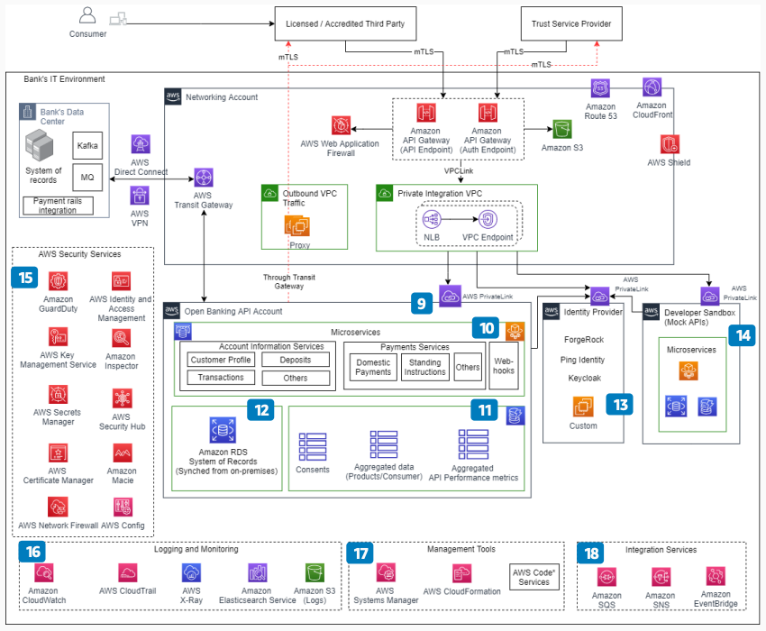

# Open Banking on AWS: Services and operations

Publication date: **September 7, 2021 ([Diagram history](#ob-p2-history "#ob-p2-history"))**

With this architecture, you can implement Open Banking API microservices, manage identity,
and monitor security posture. The solution uses [Amazon Elastic Container Service](../../../AmazonECS/latest/developerguide.md "../../../AmazonECS/latest/developerguide.md") with [AWS Fargate](../../../AmazonECS/latest/userguide/what-is-fargate.md "../../../AmazonECS/latest/userguide/what-is-fargate.md") for containerized
services, [Amazon DynamoDB](../../../amazondynamodb/latest/developerguide.md "../../../amazondynamodb/latest/developerguide.md") for consent storage, and [Amazon GuardDuty](../../../guardduty/latest/ug.md "../../../guardduty/latest/ug.md") for threat
detection.

## Open Banking services and operations diagram

The following steps describe the services and operational components for this
architecture:

1. Connect securely between VPCs and services hosted on AWS or on-premises by using
   [AWS PrivateLink](../../../vpc/latest/privatelink.md "../../../vpc/latest/privatelink.md").
2. Implement Open Banking API specifications for Account Information and Payments
   services by using multiple container-based microservices hosted on Amazon ECS with
   AWS Fargate. Cache customer account information by using [Amazon ElastiCache](../../../AmazonElastiCache/latest/red-ug.md "../../../AmazonElastiCache/latest/red-ug.md"). Host webhooks for payment
   status in this layer.
3. Store consumer consents, aggregated data, and API performance metrics in
   DynamoDB.
4. Hold a copy of the system of record in [Amazon RDS](../../../AmazonRDS/latest/UserGuide.md "../../../AmazonRDS/latest/UserGuide.md"). Synchronize data in near real time
   from the bank core system.
5. Implement the identity provider (IdP) for OAuth 2.0 in a separate AWS account so
   that other workloads in the bank can consume it securely.
6. Provide a separate developer sandbox for the third party to integrate with the bank
   AWS environment and build their products.
7. Monitor for malicious activity and unauthorized behavior by using GuardDuty. Get a
   comprehensive view of security alerts and security posture across AWS accounts by using
   [AWS Security Hub CSPM](../../../securityhub/latest/userguide.md "../../../securityhub/latest/userguide.md").
8. Collect logs from all services in [Amazon Simple Storage Service](../../../AmazonS3/latest/userguide.md "../../../AmazonS3/latest/userguide.md"). Analyze and monitor logs by using
   [Amazon OpenSearch Service](../../../opensearch-service/latest/developerguide.md "../../../opensearch-service/latest/developerguide.md").
9. Manage configuration by using AWS Systems Manager. Deploy environments by using
   [AWS CloudFormation](../../../AWSCloudFormation/latest/UserGuide.md "../../../AWSCloudFormation/latest/UserGuide.md"). Use [Amazon EventBridge](../../../eventbridge/latest/userguide.md "../../../eventbridge/latest/userguide.md"), [Amazon Simple Queue Service](../../../AWSSimpleQueueService/latest/SQSDeveloperGuide.md "../../../AWSSimpleQueueService/latest/SQSDeveloperGuide.md"),
   and [Amazon Simple Notification Service](../../../sns/latest/dg.md "../../../sns/latest/dg.md") for notification
   capability between services.

## Further reading

For additional information, see the following resources:

- [AWS Architecture Icons](https://aws.amazon.com/architecture/icons "https://aws.amazon.com/architecture/icons")
- [AWS Architecture Center](https://aws.amazon.com/architecture/ "https://aws.amazon.com/architecture/")
- [AWS
  Well-Architected](https://aws.amazon.com/architecture/well-architected "https://aws.amazon.com/architecture/well-architected")

## Diagram history

To receive updates about this reference architecture diagram, subscribe to the RSS
feed.

| Change                                                                                                             | Description                                     | Date              |
| ------------------------------------------------------------------------------------------------------------------ | ----------------------------------------------- | ----------------- |
| [Initial publication](open-banking-overview.md#ob-overview-history "open-banking-overview.md#ob-overview-history") | Reference architecture diagram first published. | September 7, 2021 |
| [Initial publication](open-banking-part1.md#ob-p1-history "open-banking-part1.md#ob-p1-history")                   | Reference architecture diagram first published. | September 7, 2021 |
| Initial publication                                                                                                | Reference architecture diagram first published. | September 7, 2021 |

###### RSS subscription requirement

To subscribe to RSS updates, you must have an RSS plugin enabled for the browser you are
using.
