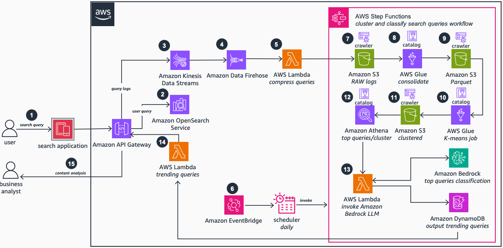

# Amazon OpenSearch Trending Queries with AWS Glue and Amazon Bedrock

Publication date: **December 18, 2024 ([Diagram history](#diagram-history "#diagram-history"))**

This architecture demonstrates how to use AWS services like [AWS Glue](../../../glue/latest/dg/what-is-glue.md "../../../glue/latest/dg/what-is-glue.md"), [Amazon Bedrock](../../../bedrock/latest/userguide/what-is-bedrock.md "../../../bedrock/latest/userguide/what-is-bedrock.md"), [Amazon OpenSearch Service](../../../opensearch-service/latest/developerguide/what-is.md "../../../opensearch-service/latest/developerguide/what-is.md"), vector embedding, K-means clustering, and LLMs to identify top trending search queries for optimizing content strategy and improving user experience.

## Amazon OpenSearch Trending Queries with AWS Glue and Amazon Bedrock

The following steps describe the architecture:

1. End users search articles on the search page. Queries are sent to Amazon OpenSearch Service for results retrieval.
2. Search query logs are streamed through [Amazon Kinesis Data Streams](../../../streams/latest/dev/introduction.md "../../../streams/latest/dev/introduction.md") using an [API Gateway](../../../apigateway/latest/developerguide/welcome.md "../../../apigateway/latest/developerguide/welcome.md") proxy.
3. [Amazon Data Firehose](../../../firehose/latest/dev/what-is-this-service.md "../../../firehose/latest/dev/what-is-this-service.md") consolidates search query logs every 15 minutes at the maximum buffer limit.
4. An [Lambda](../../../lambda/latest/dg/welcome.md "../../../lambda/latest/dg/welcome.md") function compresses search query logs for [Amazon S3](../../../AmazonS3/latest/userguide/Welcome.md "../../../AmazonS3/latest/userguide/Welcome.md") storage optimization.
5. [EventBridge](../../../eventbridge/latest/userguide/eb-what-is.md "../../../eventbridge/latest/userguide/eb-what-is.md") daily scheduler triggers [Step Functions](../../../step-functions/latest/dg/welcome.md "../../../step-functions/latest/dg/welcome.md") for trending query identification.
6. An AWS Glue crawler creates catalog tables for search query logs stored in Amazon S3.
7. An AWS Glue job consolidates and transforms query logs to Parquet files to boost query performance.
8. An AWS Glue crawler creates a catalog table for Parquet files stored in Amazon S3.
9. An AWS Glue job processes data using K-means clustering, creates search query clusters, and stores them in Amazon S3.
10. An AWS Glue crawler creates a catalog table for search query clusters stored in Amazon S3.
11. [Athena](../../../athena/latest/ug/what-is.md "../../../athena/latest/ug/what-is.md") queries the top n queries per cluster and passes a CSV file as input to a Lambda function.
12. Lambda processes the CSV file in a loop, invokes Amazon Bedrock to identify the most relevant search query per cluster, and stores results in [DynamoDB](../../../amazondynamodb/latest/developerguide/Introduction.md "../../../amazondynamodb/latest/developerguide/Introduction.md").
13. When the user opens the search page, application logic uses API Gateway to retrieve top trending queries using Lambda and the DynamoDB table for display on the search page.
14. Business analysts use a trending query API to analyze trending search queries and define content strategy.

## Further reading

For additional information, refer to the following resources:

- [AWS Architecture Icons](https://aws.amazon.com/architecture/icons "https://aws.amazon.com/architecture/icons")
- [AWS Architecture Center](https://aws.amazon.com/architecture "https://aws.amazon.com/architecture")
- [AWS Well-Architected](https://aws.amazon.com/architecture/well-architected "https://aws.amazon.com/architecture/well-architected")

## Diagram history

To be notified about updates to this reference architecture diagram, subscribe to the RSS feed.

| Change              | Description                                     | Date              |
| ------------------- | ----------------------------------------------- | ----------------- |
| Initial publication | Reference architecture diagram first published. | December 18, 2024 |

###### Note

To subscribe to RSS updates, you must have an RSS plugin enabled for the browser you are using.
