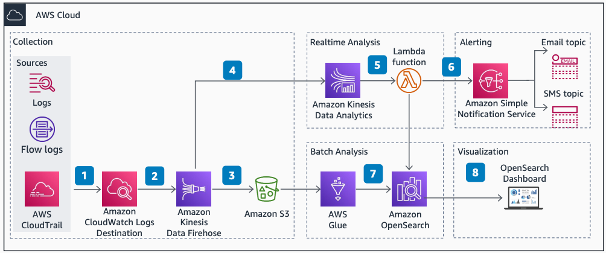

# Operational Analytics Pipeline on AWS

Publication date: **2021 ([Diagram history](#oap-diagram-history "#oap-diagram-history"))**

With this architecture, you can perform operational analytics in batch and real time. You use log information from operational data sources such as [AWS CloudTrail](../../../awscloudtrail/latest/userguide/cloudtrail-user-guide.md "../../../awscloudtrail/latest/userguide/cloudtrail-user-guide.md") and Amazon VPC flow logs. You visualize operational insights in an OpenSearch dashboard and distribute alerts through [Amazon Simple Notification Service](../../../sns/latest/dg/welcome.md "../../../sns/latest/dg/welcome.md") (Amazon SNS).

## Operational Analytics Pipeline on AWS

The following steps describe the architecture:

1. Logs stream to [Amazon CloudWatch](../../../AmazonCloudWatch/latest/monitoring/WhatIsCloudWatch.md "../../../AmazonCloudWatch/latest/monitoring/WhatIsCloudWatch.md") from various data sources. Example sources include AWS CloudTrail and Amazon VPC flow logs.
2. [Amazon Managed Service for Apache Flink](../../../managed-flink/latest/java/what-is.md "../../../managed-flink/latest/java/what-is.md") receives logs intended for real-time analysis.
3. An [Amazon S3](../../../AmazonS3/latest/userguide/Welcome.md "../../../AmazonS3/latest/userguide/Welcome.md") bucket receives logs intended for batch processing. This bucket serves as a backup for storing the raw logs.
4. Amazon CloudWatch subscription filters stream log data to [Amazon Data Firehose](../../../firehose/latest/dev/what-is-this-service.md "../../../firehose/latest/dev/what-is-this-service.md") for distribution.
5. Amazon Managed Service for Apache Flink derives metrics and sends them to a [AWS Lambda](../../../lambda/latest/dg/welcome.md "../../../lambda/latest/dg/welcome.md") function for processing. The Lambda function transforms the metrics and ingests them into [Amazon OpenSearch Service](../../../opensearch-service/latest/developerguide/what-is.md "../../../opensearch-service/latest/developerguide/what-is.md"). If a condition requires alerting, the Lambda function publishes a message to Amazon SNS for distribution.
6. [AWS Glue](../../../glue/latest/dg/what-is-glue.md "../../../glue/latest/dg/what-is-glue.md") collects the logs from Amazon S3 and performs bulk processing, transformation, and analysis. AWS Glue uses the Amazon OpenSearch Service connector to ingest the results into Amazon OpenSearch Service.
7. An OpenSearch dashboard visualizes the metrics from Amazon OpenSearch Service.
8. Amazon SNS notifies consumers of alerts by publishing to email and SMS notification topics.

## Further reading

For additional information, see the following resources:

- [AWS Architecture Icons](https://aws.amazon.com/architecture/icons "https://aws.amazon.com/architecture/icons")
- [AWS Architecture Center](https://aws.amazon.com/architecture "https://aws.amazon.com/architecture")
- [AWS Well-Architected](https://aws.amazon.com/architecture/well-architected "https://aws.amazon.com/architecture/well-architected")

## Diagram history

To be notified about updates to this reference architecture diagram, subscribe to the RSS feed.

| Change              | Description                                     | Date            |
| ------------------- | ----------------------------------------------- | --------------- |
| Initial publication | Reference architecture diagram first published. | January 1, 2021 |

###### RSS subscription

To subscribe to RSS updates, you must have an RSS plugin enabled for the browser that you are using.
