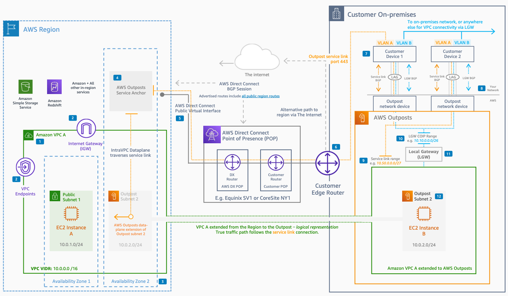

# AWS Outposts Networking Reference Architecture

Publication date: **August 5, 2022 ([Diagram history](#diagram-history "#diagram-history"))**

This architecture provides an overview of [AWS Outposts](../../../outposts/latest/userguide/what-is-outposts.md "../../../outposts/latest/userguide/what-is-outposts.md") Rack connectivity for LAN, WAN, and [Amazon VPC](../../../vpc/latest/userguide/what-is-amazon-vpc.md "../../../vpc/latest/userguide/what-is-amazon-vpc.md"). It shows how to connect an Outpost to the AWS Region using [AWS Direct Connect](../../../directconnect/latest/UserGuide/Welcome.md "../../../directconnect/latest/UserGuide/Welcome.md") or the internet.

## AWS Outposts Rack networking architecture

The following components describe this architecture:

1. Customer devices support link aggregation (LACP), VLANs, and dynamic routing (BGP) between each customer device and Outpost network device.
2. The demarcation between your network and the Outpost is the physical patch panel at the top of the rack. You provide fibers to the patch panel.
3. A Classless Inter-Domain Routing (CIDR) range that you provide for the service link is a /26 private or public IP range. This range addresses infrastructure in the Outpost that connects back to the Outpost anchor in the AWS Region.
4. An edge router with either a Direct Connect connection back to the region or the public internet reaches the AWS Outposts service anchor. Network Address Translation (NAT) or Port Address Translation (PAT) can support the service link.
5. An AWS Direct Connect public virtual interface (VIF) connects back to the AWS Outposts service anchor IPs. The public VIF advertises all Amazon public ranges from Amazon to your router.
6. The AWS Outposts service link anchor is created in the Availability Zone of your choosing and fronted by public Amazon IPs. For the full list of IP ranges, see [AWS IP address ranges](../../../general/latest/gr/aws-ip-ranges.md "../../../general/latest/gr/aws-ip-ranges.md").
7. An Outpost is homed to an Availability Zone. Multiple Amazon VPCs can associate with the same Outpost.
8. Region-level services connect from the Outpost through intra-VPC connectivity.
9. You provide a CIDR range for the Local Gateway (LGW). This Customer Owned IP (CoIP) range addresses instances inside the Outpost with Elastic IPs that need connectivity to on-premises workloads.
10. The Local Gateway, one per Outpost, attaches to one or multiple VPCs within the Outpost. The LGW provides NAT between the Outpost VPC range and the appropriate Elastic IPs from the CoIP range.
11. An Outpost subnet, created in an Amazon VPC, resides in an account that has an Outpost associated with it. You can share Outpost subnets with other accounts in the same organization.
12. Point-to-point VLANs are configured between each Outpost network device and your customer device. **VLAN A** supports service link connectivity and **VLAN B** supports Local Gateway connectivity.

## Further reading

For additional information, see the following resources:

- [AWS Architecture Icons](https://aws.amazon.com/architecture/icons "https://aws.amazon.com/architecture/icons")
- [AWS Architecture Center](https://aws.amazon.com/architecture "https://aws.amazon.com/architecture")
- [AWS Well-Architected](https://aws.amazon.com/architecture/well-architected "https://aws.amazon.com/architecture/well-architected")

## Diagram history

To be notified about updates to this reference architecture diagram, subscribe to the RSS feed.

| Change              | Description                                     | Date           |
| ------------------- | ----------------------------------------------- | -------------- |
| Initial publication | Reference architecture diagram first published. | August 5, 2022 |

###### Note

To subscribe to RSS updates, you must have an RSS plugin enabled for the browser you are using.
