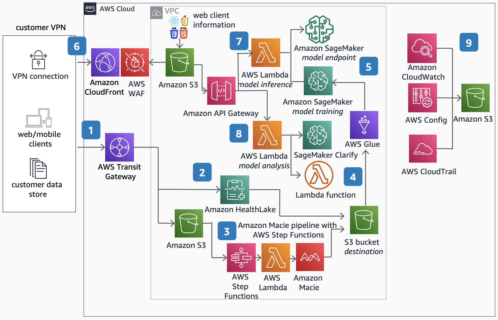

# Patient Outcome Prediction

Publication date: **September 14, 2022 ([Diagram history](#pop-history "#pop-history"))**

With this architecture, you can use machine learning (ML) on patient health data to train
models that predict medical outcomes. The solution uses [AWS HealthLake](../../../healthlake/latest/devguide.md "../../../healthlake/latest/devguide.md") to transform health data, [Amazon SageMaker AI](../../../sagemaker/latest/dg.md "../../../sagemaker/latest/dg.md") to train and deploy custom
prediction models, and [Amazon Macie](../../../macie/latest/user.md "../../../macie/latest/user.md") to discover and protect sensitive data.

## Patient outcome prediction diagram

The following steps describe the data flow and prediction pipeline for this
architecture:

1. Access the Patient Outcome Prediction application and input your health data, such
   as medical records, insurance claims, lab reports, and doctor's notes, through AWS Transit
   Gateway.
2. Input your health data into AWS HealthLake, a HIPAA-eligible service that
   transforms health data to be more easily queried and ML-ingestible.
3. Run privacy-sensitive datasets through Amazon Macie with a series of [AWS Step Functions](../../../step-functions/latest/dg.md "../../../step-functions/latest/dg.md") to discover and
   protect sensitive data.
4. Store your data from HealthLake and Macie in [Amazon Simple Storage Service](../../../AmazonS3/latest/userguide.md "../../../AmazonS3/latest/userguide.md"). Process the data with [AWS Glue](../../../glue/latest/dg.md "../../../glue/latest/dg.md"), which transforms and
   prepares it for ingestion as training data into a custom SageMaker AI model.
5. Train custom SageMaker AI models to predict patient outcomes such as disease progression and
   hospital readmission probability. Create SageMaker AI model endpoints for inference.
6. Access the web client frontend to perform model inference through [Amazon CloudFront](../../../AmazonCloudFront/latest/DeveloperGuide.md "../../../AmazonCloudFront/latest/DeveloperGuide.md") and
   [AWS WAF](../../../waf/latest/developerguide.md "../../../waf/latest/developerguide.md").
7. Pick a SageMaker AI model endpoint to perform predictions by using a [AWS Lambda](../../../lambda/latest/dg.md "../../../lambda/latest/dg.md") function.
8. Explore model explainability by using a Lambda function that invokes SageMaker AI Clarify to
   examine potential bias in training data and trained models.
9. Record all Amazon VPC flow logs, API metrics, and AWS resource usage by using [Amazon CloudWatch](../../../AmazonCloudWatch/latest/monitoring.md "../../../AmazonCloudWatch/latest/monitoring.md"), [AWS Config](../../../config/latest/developerguide.md "../../../config/latest/developerguide.md"), and AWS
   CloudTrail for operational and cost monitoring.

## Further reading

For additional information, see the following resources:

- [AWS Architecture Icons](https://aws.amazon.com/architecture/icons "https://aws.amazon.com/architecture/icons")
- [AWS Architecture Center](https://aws.amazon.com/architecture/ "https://aws.amazon.com/architecture/")
- [AWS
  Well-Architected](https://aws.amazon.com/architecture/well-architected "https://aws.amazon.com/architecture/well-architected")

## Diagram history

To receive updates about this reference architecture diagram, subscribe to the RSS
feed.

| Change              | Description                                     | Date               |
| ------------------- | ----------------------------------------------- | ------------------ |
| Initial publication | Reference architecture diagram first published. | September 14, 2022 |

###### RSS subscription requirement

To subscribe to RSS updates, you must have an RSS plugin enabled for the browser you are
using.
