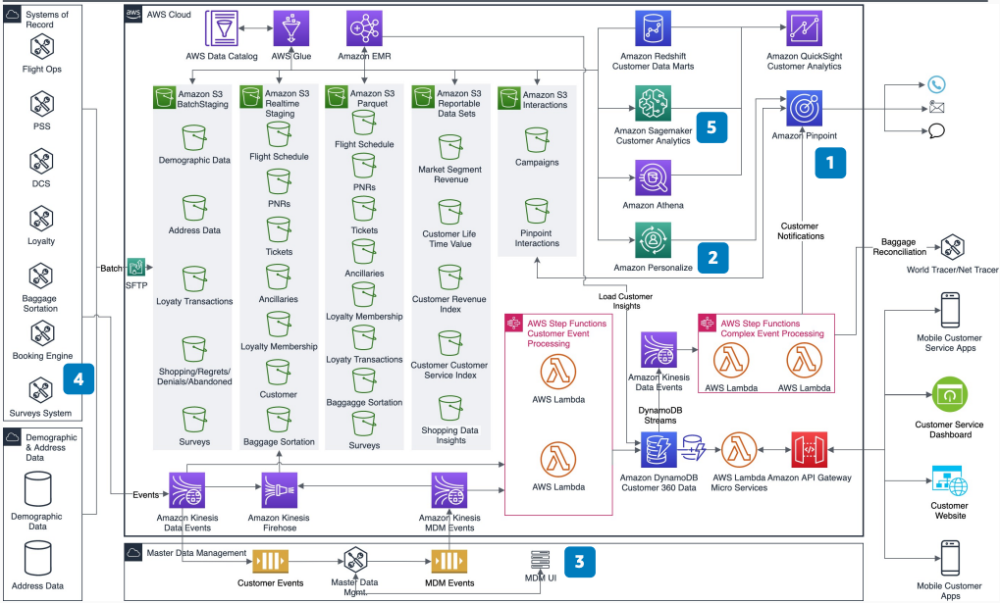

# Personalization Using AI/ML for Airlines

Publication date: **November 14, 2019 ([Diagram history](#personalization-airlines-history "#personalization-airlines-history"))**

With this architecture, you can personalize customer communications for airlines.
Airlines often require multiple providers to build separate operational email, notification,
and campaign systems. These systems typically do not work well together. They do not scale to
meet new data feeds and new channels of communication.

This personalization workflow addresses these challenges by integrating multiple AWS
services to personalize the customer communication experience. This reference architecture
uses the [Traveler 360
Data Platform for Airlines](../traveler-360-airlines/traveler-360-airlines.md "../traveler-360-airlines/traveler-360-airlines.md") as
its foundation. It offers personalization with artificial intelligence (AI) and machine
learning (ML) services.

## Personalization AI/ML for airlines diagram

The following steps describe the architecture:

1. Use [Amazon Pinpoint](../../../pinpoint/latest/userguide.md "../../../pinpoint/latest/userguide.md") for operational and notification
   communications. Deliver messages across email, SMS, voice, and push channels.
2. Use [Amazon Personalize](../../../personalize/latest/dg.md "../../../personalize/latest/dg.md") for segmentation, target lists, and
   personalized offers from the data lake. Use Amazon Pinpoint to deliver those personalized
   offers.
3. Improve effectiveness with master data management (MDM) integration.
   MDM provides a unified traveler profile for accurate targeting.
4. Extend capability by adding shopping data, baggage sortation, and baggage
   reconciliation domains to the data platform.
5. Create new artificial intelligence and machine learning (AI/ML) models.
   Use [Amazon SageMaker AI](../../../sagemaker/latest/dg.md "../../../sagemaker/latest/dg.md") for
   customer lifetime value and segmentation models.

## Further reading

For additional information, see the following resources:

- [AWS Architecture Icons](https://aws.amazon.com/architecture/icons "https://aws.amazon.com/architecture/icons")
- [AWS Architecture Center](https://aws.amazon.com/architecture/ "https://aws.amazon.com/architecture/")
- [AWS Well-Architected](https://aws.amazon.com/architecture/well-architected "https://aws.amazon.com/architecture/well-architected")

## Diagram history

To receive updates about this reference architecture diagram, subscribe to the RSS
feed.

| Change              | Description                                     | Date              |
| ------------------- | ----------------------------------------------- | ----------------- |
| Initial publication | Reference architecture diagram first published. | November 14, 2019 |

###### RSS subscription requirement

To subscribe to RSS updates, you must have an RSS plugin enabled for the browser you
are using.
