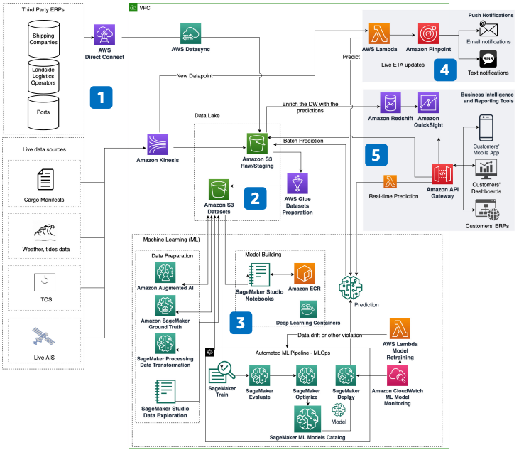

# Predict Vessel Time of Arrival at Berth

Publication date: **July 16, 2020 ([Diagram history](#vessel-history "#vessel-history"))**

With this architecture, you can predict vessel time of arrival at berth. Accurate
predictions help you coordinate cargo operations and reduce idle time. The solution uses [Amazon SageMaker AI](../../../sagemaker/latest/dg.md "../../../sagemaker/latest/dg.md") for machine learning (ML)
model training and inference, [Amazon Kinesis](../../../streams/latest/dev.md "../../../streams/latest/dev.md") for real-time streaming, and [Amazon Simple Storage Service](../../../AmazonS3/latest/userguide.md "../../../AmazonS3/latest/userguide.md") as the data
lake.

## Vessel arrival prediction diagram

The following steps describe the data pipeline and ML workflow for this
architecture:

1. Build a low-latency data pipeline from multiple data sources. Use AWS managed
   networking and data synchronization services. Stream and transform live data in real time
   with Amazon Kinesis.
2. Store all data in a single data lake on Amazon S3. Prepare data for ML processing with
   [AWS Glue](../../../glue/latest/dg.md "../../../glue/latest/dg.md"). Store SageMaker AI ML models
   and outputs in dedicated Amazon S3 buckets. Use Amazon S3 Intelligent-Tiering for cost-effective
   scalability.
3. Orchestrate SageMaker AI capabilities with a manual or automated workflow. Train, evaluate,
   optimize, deploy, and test the ML model. Expose the model as an API for real-time or
   batch predictions.
4. Send real-time push notifications when SageMaker AI detects possible vessel delays. Use a
   [AWS Lambda](../../../lambda/latest/dg.md "../../../lambda/latest/dg.md") function with
   SageMaker AI endpoint integration and Amazon Kinesis to raise alarms.
5. Import predictions to enrich your [Amazon Redshift](../../../redshift/latest/mgmt.md "../../../redshift/latest/mgmt.md") data warehouse. Visualize reports by using
   [Amazon Quick Sight](../../../quicksight/latest/developerguide/welcome.md "../../../quicksight/latest/developerguide/welcome.md") to discover
   trends and implement corrective actions.

## Further reading

For additional information, see the following resources:

- [AWS Architecture Icons](https://aws.amazon.com/architecture/icons "https://aws.amazon.com/architecture/icons")
- [AWS Architecture Center](https://aws.amazon.com/architecture/ "https://aws.amazon.com/architecture/")
- [AWS
  Well-Architected](https://aws.amazon.com/architecture/well-architected "https://aws.amazon.com/architecture/well-architected")

## Diagram history

To receive updates about this reference architecture diagram, subscribe to the RSS
feed.

| Change              | Description                                     | Date          |
| ------------------- | ----------------------------------------------- | ------------- |
| Initial publication | Reference architecture diagram first published. | July 16, 2020 |

###### RSS subscription requirement

To subscribe to RSS updates, you must have an RSS plugin enabled for the browser you are
using.
