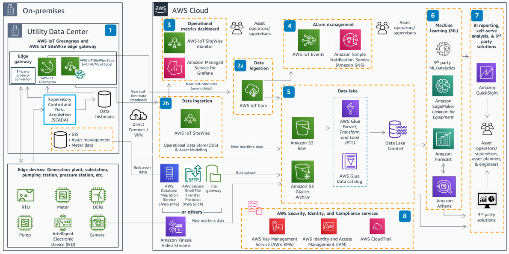

# Predictive Equipment Health for Utilities

Publication date: **August 3, 2021 ([Diagram history](#peh-history "#peh-history"))**

With this architecture, you can build a modern, end-to-end, field-to-cloud solution for
ingesting near-real-time data from utility assets and devices. The solution uses [AWS IoT SiteWise](../../../iot-sitewise/latest/userguide.md "../../../iot-sitewise/latest/userguide.md") for asset
modeling, [Amazon SageMaker AI](../../../sagemaker/latest/dg.md "../../../sagemaker/latest/dg.md") and [Amazon Forecast](../../../forecast/latest/dg.md "../../../forecast/latest/dg.md") for predictive health
analysis, and [Amazon Simple Storage Service](../../../AmazonS3/latest/userguide.md "../../../AmazonS3/latest/userguide.md") as the data lake.

## Predictive equipment health diagram

The following steps describe the data flow and analytics pipeline for this
architecture:

1. Connect edge data sources by using [AWS IoT Greengrass](../../../greengrass/v2/developerguide.md "../../../greengrass/v2/developerguide.md") and AWS IoT SiteWise edge for seamless
   connectivity and data preparation from Supervisory Control and Data Acquisition (SCADA)
   systems, third-party protocol converters, Geographic Information Systems (GIS), data
   historians, and edge devices. Run compiled ML models on AWS IoT SiteWise edge for local inference
   and actioning.
2. 2A. Ingest data directly from assets to [AWS IoT Core](../../../iot/latest/developerguide.md "../../../iot/latest/developerguide.md") for non-asset-modeled data.

2B. Ingest data at scale with asset modeling in AWS IoT SiteWise. 3. View real-time operational dashboards of critical asset performance metrics through
AWS IoT SiteWise monitor or [Amazon Managed Service for
Grafana](../../../grafana/latest/userguide.md "../../../grafana/latest/userguide.md"). 4. Build detector models in [AWS IoT Events](../../../iotevents/latest/developerguide.md "../../../iotevents/latest/developerguide.md") to continuously monitor asset
state. Issue immediate email and SMS alerts to operational staff through [Amazon Simple Notification Service](../../../sns/latest/dg.md "../../../sns/latest/dg.md"). 5. Use Amazon S3 as the data lake and single version of truth for all consumers. Perform ETL
functions and build the data catalog with [AWS Glue](../../../glue/latest/dg.md "../../../glue/latest/dg.md"). Move infrequently accessed data to Amazon S3 Glacier
for cost-effective archival. 6. Use curated data from the data lake with AWS AI/ML services (such as SageMaker AI and
Forecast) or third-party ML services for predictive health analysis and assessment. Consume
results through asset owner applications or third-party asset management tools. 7. Produce detailed business intelligence (BI) reporting through [Amazon Quick Sight](../../../quicksight/latest/developerguide/welcome.md "../../../quicksight/latest/developerguide/welcome.md") and third-party
solutions (GIS, asset management, and Tableau). 8. Secure all communication with AWS Security, Identity, and Compliance services.
Ensure that data is fully traceable, authenticated, and encrypted.

## Further reading

For additional information, see the following resources:

- [AWS Architecture Icons](https://aws.amazon.com/architecture/icons "https://aws.amazon.com/architecture/icons")
- [AWS Architecture Center](https://aws.amazon.com/architecture/ "https://aws.amazon.com/architecture/")
- [AWS
  Well-Architected](https://aws.amazon.com/architecture/well-architected "https://aws.amazon.com/architecture/well-architected")

## Diagram history

To receive updates about this reference architecture diagram, subscribe to the RSS
feed.

| Change              | Description                                     | Date           |
| ------------------- | ----------------------------------------------- | -------------- |
| Initial publication | Reference architecture diagram first published. | August 3, 2021 |

###### RSS subscription requirement

To subscribe to RSS updates, you must have an RSS plugin enabled for the browser you are
using.
