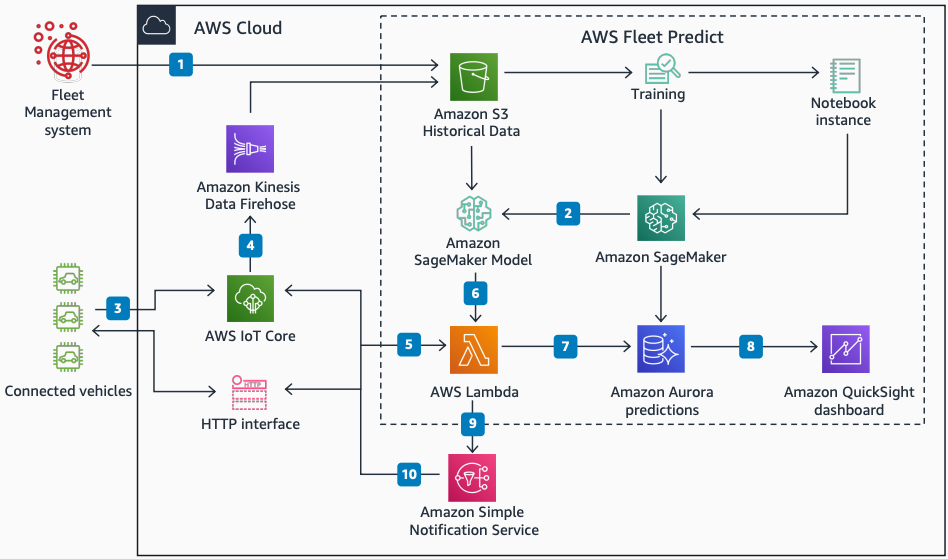

# Predictive Maintenance for Fleets

Publication date: **October 21, 2020 ([Diagram history](#fleet-history "#fleet-history"))**

With this architecture, you can predict battery failures in your vehicle fleet. Train a
predictive model on historical telemetry data, then run it against live telemetry. Schedule
controlled maintenance events before failures occur. The solution uses [AWS IoT Core](../../../iot/latest/developerguide.md "../../../iot/latest/developerguide.md") for vehicle
connectivity, [Amazon SageMaker AI](../../../sagemaker/latest/dg.md "../../../sagemaker/latest/dg.md") for
model training and deployment, and [Amazon Aurora](../../../AmazonRDS/latest/AuroraUserGuide.md "../../../AmazonRDS/latest/AuroraUserGuide.md") for prediction storage.

## Fleet predictive maintenance diagram

The following steps describe the ML pipeline and notification flow for this
architecture:

1. Create an extract from the Fleet Management system. Include vehicle data and
   historical sensor logs.
2. Deploy the SageMaker AI model after training it to predict battery failures.
3. Send sensor logs from connected vehicles to AWS IoT Core. You can also send logs by
   using the HTTP interface.
4. Send telemetry messages from AWS IoT Core to [AWS Lambda](../../../lambda/latest/dg.md "../../../lambda/latest/dg.md") for analysis by the model.
5. Send the sensor logs to Lambda for analysis. Run the trained model against the
   data.
6. Use Lambda with the trained prediction model on sensor logs to generate
   predictions.
7. Store completed predictions in Amazon Aurora for record-keeping and future model
   improvements.
8. Display predictions on the [Amazon Quick Sight](../../../quicksight/latest/developerguide/welcome.md "../../../quicksight/latest/developerguide/welcome.md") dashboard.
9. Send real-time failure warning notifications to [Amazon Simple Notification Service](../../../sns/latest/dg.md "../../../sns/latest/dg.md").
10. Notify connected vehicles through Amazon SNS to alert drivers and fleet managers.
    Schedule a controlled maintenance event before the predicted failure.

## Further reading

For additional information, see the following resources:

- [AWS Architecture Icons](https://aws.amazon.com/architecture/icons "https://aws.amazon.com/architecture/icons")
- [AWS Architecture Center](https://aws.amazon.com/architecture/ "https://aws.amazon.com/architecture/")
- [AWS
  Well-Architected](https://aws.amazon.com/architecture/well-architected "https://aws.amazon.com/architecture/well-architected")

## Diagram history

To receive updates about this reference architecture diagram, subscribe to the RSS
feed.

| Change              | Description                                     | Date             |
| ------------------- | ----------------------------------------------- | ---------------- |
| Initial publication | Reference architecture diagram first published. | October 21, 2020 |

###### RSS subscription requirement

To subscribe to RSS updates, you must have an RSS plugin enabled for the browser you are
using.
