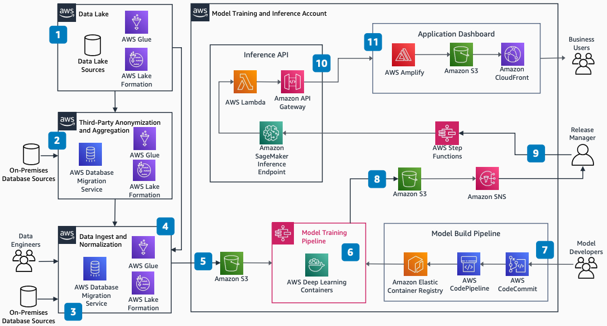

# Predictive Modeling for Automotive Retail

Publication date: **September 15, 2021 ([Diagram history](#auto-predict-history "#auto-predict-history"))**

With this architecture, you can predict fine-grained return on investment (ROI) for
automotive sales incentives. The solution uses [Amazon SageMaker AI](../../../sagemaker/latest/dg.md "../../../sagemaker/latest/dg.md") for model training and inference, [AWS Glue](../../../glue/latest/dg.md "../../../glue/latest/dg.md") for data preprocessing, and
[AWS Step Functions](../../../step-functions/latest/dg.md "../../../step-functions/latest/dg.md") for pipeline orchestration.

## Predictive modeling for automotive retail diagram

The following steps describe the architecture:

1. Use a centralized data lake account to accelerate development of new use
   cases.
2. Strip personally identifiable information. Aggregate data to obfuscate dealer
   specifics and prevent bias for or against OEM dealers.
3. Use [AWS Database Migration Service](../../../dms/latest/userguide.md "../../../dms/latest/userguide.md") to replicate
   on-premises databases that are not available through a data lake account.
4. Preprocess data with AWS Glue PySpark Transforms and output the
   results into a primary table for model training.
5. Push the training input primary table from the data ingestion pipeline at regular
   intervals and store it in [Amazon Simple Storage Service](../../../AmazonS3/latest/userguide.md "../../../AmazonS3/latest/userguide.md").
6. Trigger the model training pipeline when the primary table changes. The pipeline
   includes hyperparameter tuning, validation, and fit. Step Functions controls this pipeline by using
   AWS Deep Learning Containers.
7. Trigger a container build on model source commits. Store the container in [Amazon Elastic Container Registry](../../../AmazonECR/latest/userguide.md "../../../AmazonECR/latest/userguide.md").
8. Store versioned model outputs in Amazon S3, including the training report and
   evaluation.
9. Use [Amazon Simple Notification Service](../../../sns/latest/dg.md "../../../sns/latest/dg.md") to notify an
   administrator for review before triggering deployment with Step Functions.
10. Serve inference requests through [Amazon API Gateway](../../../apigateway/latest/developerguide.md "../../../apigateway/latest/developerguide.md"), [AWS Lambda](../../../lambda/latest/dg.md "../../../lambda/latest/dg.md"), and an SageMaker AI endpoint that uses the trained
    model container.
11. Build the inference dashboard by using [AWS Amplify](../../../amplify/latest/userguide.md "../../../amplify/latest/userguide.md"). Host static content on Amazon S3 and
    serve it through [Amazon CloudFront](../../../AmazonCloudFront/latest/DeveloperGuide.md "../../../AmazonCloudFront/latest/DeveloperGuide.md").

## Further reading

For additional information, see the following resources:

- [AWS Architecture Icons](https://aws.amazon.com/architecture/icons "https://aws.amazon.com/architecture/icons")
- [AWS Architecture Center](https://aws.amazon.com/architecture/ "https://aws.amazon.com/architecture/")
- [AWS
  Well-Architected](https://aws.amazon.com/architecture/well-architected "https://aws.amazon.com/architecture/well-architected")

## Diagram history

To receive updates about this reference architecture diagram, subscribe to the RSS
feed.

| Change              | Description                                     | Date               |
| ------------------- | ----------------------------------------------- | ------------------ |
| Initial publication | Reference architecture diagram first published. | September 15, 2021 |

###### RSS subscription requirement

To subscribe to RSS updates, you must have an RSS plugin enabled for the browser you are
using.
