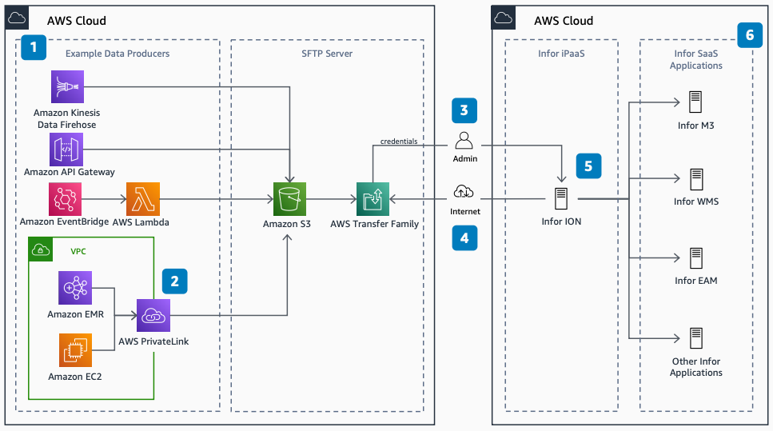

# Producing Data to InforOS over SFTP

Publication date: **March 20, 2021 ([Diagram history](#pdi-diagram-history "#pdi-diagram-history"))**

With this architecture, you can integrate your applications with
Infor CloudSuite by using bulk data transfer over Secure File Transfer Protocol
(SFTP). You use [AWS Transfer Family](../../../transfer/latest/userguide.md "../../../transfer/latest/userguide.md")
as the managed SFTP server, with [Amazon Simple Storage Service](../../../AmazonS3/latest/userguide.md "../../../AmazonS3/latest/userguide.md") (Amazon S3) for storage.

## Producing data to InforOS architecture diagram

The following steps describe the architecture:

1. Example producers write data to Amazon S3. These include [AWS Lambda](../../../lambda/latest/dg.md "../../../lambda/latest/dg.md"), [Amazon Data Firehose](../../../firehose/latest/dev.md "../../../firehose/latest/dev.md"), [Amazon API Gateway](../../../apigateway/latest/developerguide.md "../../../apigateway/latest/developerguide.md"), [Amazon EventBridge](../../../eventbridge/latest/userguide.md "../../../eventbridge/latest/userguide.md"), [Amazon EMR](../../../emr/latest/ManagementGuide.md "../../../emr/latest/ManagementGuide.md"), and [Amazon Elastic Compute Cloud](../../../AWSEC2/latest/UserGuide.md "../../../AWSEC2/latest/UserGuide.md").
2. (Optional) Use AWS PrivateLink to avoid over-the-internet traffic between your
   [Amazon VPC](../../../vpc/latest/userguide.md "../../../vpc/latest/userguide.md") and Amazon S3.
3. An administrator creates an SFTP user in Transfer Family and passes credentials to
   Infor ION.
4. Files moving over SFTP can be BOD/XML, delimiter-separated, JSON, or
   schema-free formats.
5. Infor ION acts as an SFTP client, polling the SFTP server for
   new data.
6. Infor CloudSuite applications consume data. These applications
   include Infor M3, Infor WMS, Infor EAM,
   and others.

## Further reading

For additional information, see the following resources:

- [AWS Architecture Icons](https://aws.amazon.com/architecture/icons "https://aws.amazon.com/architecture/icons")
- [AWS Architecture Center](https://aws.amazon.com/architecture "https://aws.amazon.com/architecture")
- [AWS Well-Architected](https://aws.amazon.com/architecture/well-architected "https://aws.amazon.com/architecture/well-architected")
- [Consuming Data from InforOS over SFTP](../consuming-data-from-inforos/consuming-data-from-inforos.md "../consuming-data-from-inforos/consuming-data-from-inforos.md")

## Diagram history

To be notified about updates to this reference architecture diagram, subscribe to the RSS feed.

| Change              | Description                                     | Date           |
| ------------------- | ----------------------------------------------- | -------------- |
| Initial publication | Reference architecture diagram first published. | March 20, 2021 |

###### RSS subscription

To subscribe to RSS updates, you must have an RSS plugin enabled for the browser that you are using.
