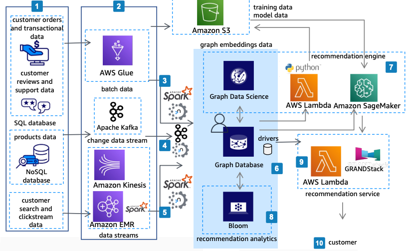

# Product Recommendations Powered by Neo4j

Publication date: **September 20, 2022 ([Diagram history](#neo4j-rec-history "#neo4j-rec-history"))**

With this architecture, you can deliver personalized product recommendations in near real
time. The solution uses Neo4j Graph Database (GDB) and Graph Data Science (GDS)
on AWS for storing and analyzing connected data, [Amazon EMR](../../../emr/latest/ManagementGuide.md "../../../emr/latest/ManagementGuide.md") for data processing, [Amazon SageMaker AI](../../../sagemaker/latest/dg.md "../../../sagemaker/latest/dg.md") for machine learning (ML),
and [Amazon Kinesis](../../../streams/latest/dev.md "../../../streams/latest/dev.md") for streaming
ingestion.

## Product recommendations diagram

The following steps describe the data pipeline and recommendation engine for this
architecture:

1. Ingest customer orders, product data, and clickstream data through [Amazon Redshift](../../../redshift/latest/mgmt.md "../../../redshift/latest/mgmt.md"), [Amazon RDS](../../../AmazonRDS/latest/UserGuide.md "../../../AmazonRDS/latest/UserGuide.md"), Amazon EMR, [Amazon Simple Storage Service](../../../AmazonS3/latest/userguide.md "../../../AmazonS3/latest/userguide.md"), and
   Amazon Kinesis.
2. Transform and enrich data by using [AWS Glue](../../../glue/latest/dg.md "../../../glue/latest/dg.md"), Apache Spark on Amazon EMR, [AWS Lambda](../../../lambda/latest/dg.md "../../../lambda/latest/dg.md"), or other
   tools.
3. Load bulk and batch data to Neo4j by using the Neo4j
   Spark Connector for Amazon EMR or Neo4j APIs running in Lambda.
4. Stream near real-time data from Apache Kafka on AWS through the
   Neo4j Kafka Connector to the Neo4j database.
5. Flow clickstream data from Amazon Kinesis through the Neo4j Spark Connector
   running on Amazon EMR to the Neo4j database.
6. Store, query, analyze, and manage highly connected data by using Neo4j
   GDB and GDS. Deploy Neo4j Aura as a fully managed service on AWS, or
   run Neo4j Enterprise on [Amazon Elastic Compute Cloud](../../../AWSEC2/latest/UserGuide.md "../../../AWSEC2/latest/UserGuide.md") instances.
7. Create features on Neo4j GDB and GDS. Export graph embeddings to
   SageMaker AI for training ML models.
8. Explore data and present findings by using [Amazon Quick Sight](../../../quicksight/latest/developerguide/welcome.md "../../../quicksight/latest/developerguide/welcome.md") and Neo4j Bloom
   visualization tools.
9. Access Neo4j by using official drivers from Lambda or any application.
   Use a low-code approach with GraphQL API and the GRANDStack
   framework through [Amazon API Gateway](../../../apigateway/latest/developerguide.md "../../../apigateway/latest/developerguide.md").
10. Run the recommendation services by using Neo4j GDB and GDS at scale
    in near real time. Apply this framework to build similar recommendation engines for
    additional use cases.

## Further reading

For additional information, see the following resources:

- [AWS Architecture Icons](https://aws.amazon.com/architecture/icons "https://aws.amazon.com/architecture/icons")
- [AWS Architecture Center](https://aws.amazon.com/architecture/ "https://aws.amazon.com/architecture/")
- [AWS
  Well-Architected](https://aws.amazon.com/architecture/well-architected "https://aws.amazon.com/architecture/well-architected")

## Diagram history

To receive updates about this reference architecture diagram, subscribe to the RSS
feed.

| Change              | Description                                     | Date               |
| ------------------- | ----------------------------------------------- | ------------------ |
| Initial publication | Reference architecture diagram first published. | September 20, 2022 |

###### RSS subscription requirement

To subscribe to RSS updates, you must have an RSS plugin enabled for the browser you are
using.
