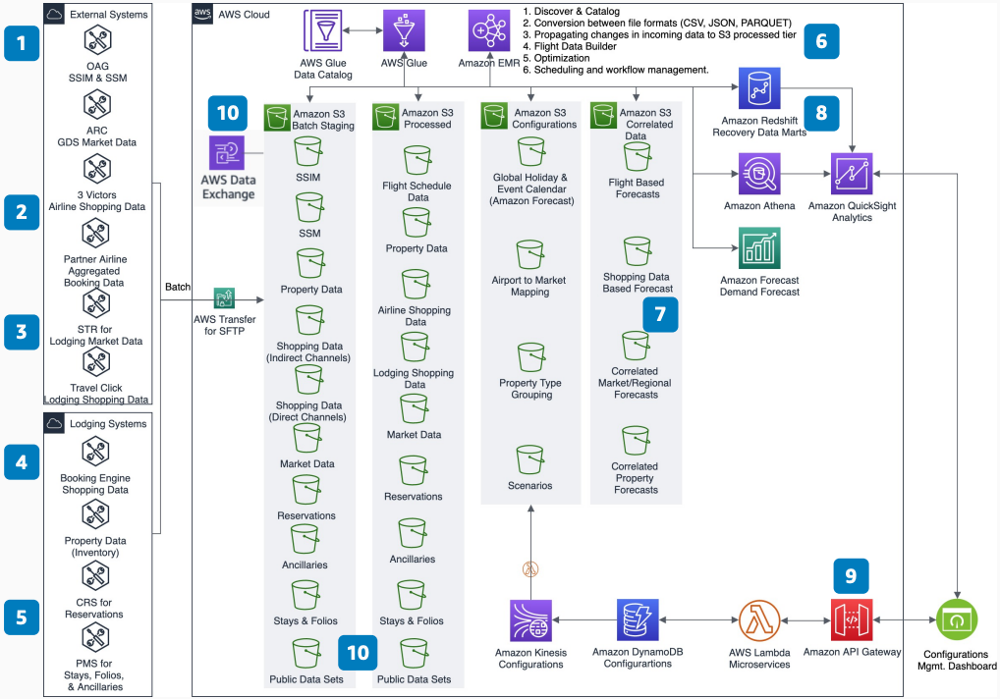

# Property Optimizer for Lodging

Publication date: **April 16, 2020 ([Diagram history](#propopt-history "#propopt-history"))**

With this architecture, you can forecast lodging demand and optimize property performance.
Use airline schedules, shopping data, and booking information as inputs. Generate regional and
property-level forecasts with artificial intelligence and machine learning (AI/ML). The
solution uses [Amazon Forecast](../../../forecast/latest/dg.md "../../../forecast/latest/dg.md") for ML-based forecasting, [AWS Glue](../../../glue/latest/dg.md "../../../glue/latest/dg.md") for data processing, and [Amazon Quick Sight](../../../quicksight/latest/developerguide/welcome.md "../../../quicksight/latest/developerguide/welcome.md") for
visualization.

## Property optimizer diagram

The following steps describe the data pipeline and forecasting components for this
architecture:

1. Collect daily airline arrivals and departures at each airport from OAG
   schedules.
2. Collect future airline shopping trends and booking data from sources such as Airline
   Reporting Corporation, 3Victors, and partner airlines.
3. Collect future lodging shopping trends and booking data for indirect channels from
   sources such as STR and TravelClick.
4. Use lodging booking engines as a source of shopping trends for direct
   booking.
5. Collect property data, booking, and stay data from the central reservations system
   (CRS) and property management system (PMS).
6. Use AWS Glue and [Amazon EMR](../../../emr/latest/ManagementGuide.md "../../../emr/latest/ManagementGuide.md") to discover, catalog, and process
   inputs. Create processed data in [Amazon Simple Storage Service](../../../AmazonS3/latest/userguide.md "../../../AmazonS3/latest/userguide.md") in Parquet format.
7. Combine lodging and flight data to create accurate forecasts. Use Forecast to create
   AI/ML-based forecasting from historical recovery data.
8. Visualize reports by using on-demand [Amazon Athena](../../../athena/latest/ug.md "../../../athena/latest/ug.md") and Amazon Quick Sight. For standardized recovery
   reports, use [Amazon Redshift](../../../redshift/latest/mgmt.md "../../../redshift/latest/mgmt.md") to
   create data marts.
9. (Optional) Build a configuration dashboard with microservices. Use [Amazon API Gateway](../../../apigateway/latest/developerguide.md "../../../apigateway/latest/developerguide.md"), [AWS Lambda](../../../lambda/latest/dg.md "../../../lambda/latest/dg.md"), and [Amazon DynamoDB](../../../amazondynamodb/latest/developerguide.md "../../../amazondynamodb/latest/developerguide.md") to collect configuration
   changes and create what-if analyses.
10. Use public datasets from [AWS Data Exchange](../../../data-exchange/latest/userguide.md "../../../data-exchange/latest/userguide.md") to enhance decision
    making.

## Further reading

For additional information, see the following resources:

- [AWS Architecture Icons](https://aws.amazon.com/architecture/icons "https://aws.amazon.com/architecture/icons")
- [AWS Architecture Center](https://aws.amazon.com/architecture/ "https://aws.amazon.com/architecture/")
- [AWS
  Well-Architected](https://aws.amazon.com/architecture/well-architected "https://aws.amazon.com/architecture/well-architected")

## Diagram history

To receive updates about this reference architecture diagram, subscribe to the RSS
feed.

| Change              | Description                                     | Date           |
| ------------------- | ----------------------------------------------- | -------------- |
| Initial publication | Reference architecture diagram first published. | April 16, 2020 |

###### RSS subscription requirement

To subscribe to RSS updates, you must have an RSS plugin enabled for the browser you are
using.
