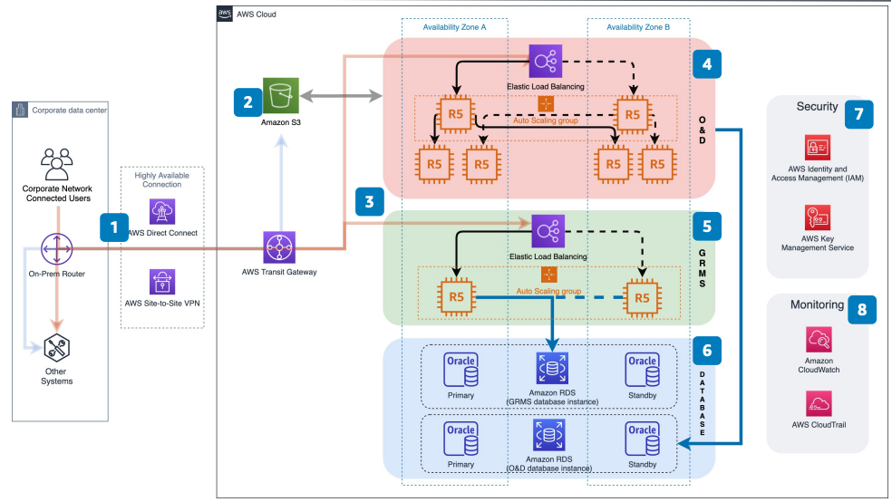

# PROS Revenue Management Platform on AWS

Publication date: **August 20, 2020 ([Diagram history](#pros-revenue-management-history "#pros-revenue-management-history"))**

This reference architecture creates a highly available, secure, flexible, and
cost-effective architecture on AWS. Use it to host a PROS application with
two modules: Origin and Destination (O&D) and Group Revenue Management System
(GRMS).

The PROS application manages revenue optimization for airlines. This
architecture connects on-premises systems to AWS with redundant network paths. It
provides automated failover for compute and database layers.

## PROS revenue management platform diagram

The following steps describe the architecture:

1. Connect on-premises users and systems through [AWS Direct Connect](../../../directconnect/latest/UserGuide.md "../../../directconnect/latest/UserGuide.md") as the primary
   connection. Use AWS Site-to-Site VPN as the secondary connection.
2. Use [Amazon S3](../../../AmazonS3/latest/userguide.md "../../../AmazonS3/latest/userguide.md")
   for PROS applications to exchange files with upstream and downstream
   systems. Applications generate files after batch jobs and store them for
   retrieval.
3. The PROS application has an O&D module and a GRMS module.
   Access both modules only by private IP addresses. Connect Amazon VPCs (production and
   development) through [AWS Transit Gateway](../../../vpc/latest/tgw.md "../../../vpc/latest/tgw.md").
4. The O&D module primary node distributes traffic and jobs to worker nodes.
   Configure manual failover to a worker node. You can also automate failover
   through an Auto Scaling group and script integration. For worker node failover,
   automate with [CloudWatch](../../../AmazonCloudWatch/latest/monitoring.md "../../../AmazonCloudWatch/latest/monitoring.md") and [Lambda](../../../lambda/latest/dg.md "../../../lambda/latest/dg.md").
5. The GRMS module runs in active-passive mode. If the running [Amazon EC2](../../../AWSEC2/latest/UserGuide.md "../../../AWSEC2/latest/UserGuide.md") instance fails,
   a new instance is provisioned. Automate failover through an Auto Scaling
   group.
6. Both O&D and GRMS use [Amazon RDS](../../../AmazonRDS/latest/UserGuide.md "../../../AmazonRDS/latest/UserGuide.md") for Oracle. Configure single-AZ
   (recovered from snapshot) or Multi-AZ (standby with failover). Use
   memory-optimized Amazon EC2 R5 instances for the O&D database.
7. AWS Key Management Service provides data-at-rest
   encryption at the database layer.
8. CloudWatch monitors the health of Amazon EC2 instances and Amazon RDS databases.

## Further reading

For additional information, see the following resources:

- [AWS Architecture Icons](https://aws.amazon.com/architecture/icons "https://aws.amazon.com/architecture/icons")
- [AWS Architecture Center](https://aws.amazon.com/architecture/ "https://aws.amazon.com/architecture/")
- [AWS Well-Architected](https://aws.amazon.com/architecture/well-architected "https://aws.amazon.com/architecture/well-architected")

## Diagram history

To receive updates about this reference architecture diagram, subscribe to the RSS
feed.

| Change              | Description                                     | Date            |
| ------------------- | ----------------------------------------------- | --------------- |
| Initial publication | Reference architecture diagram first published. | August 20, 2020 |

###### RSS subscription requirement

To subscribe to RSS updates, you must have an RSS plugin enabled for the browser you
are using.
