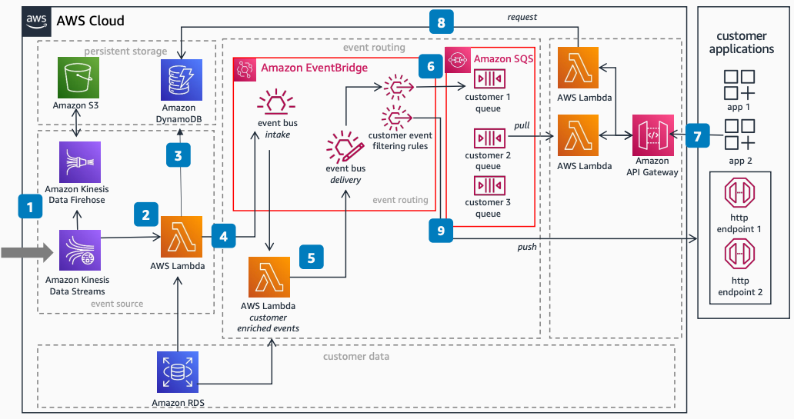

# Provide DaaS to Fleet Customers: Data flow

Publication date: **February 16, 2023 ([Diagram history](#daas-flow-history "#daas-flow-history"))**

With this architecture, you can build a serverless Data as a Service (DaaS) platform.
Ingest, process, and deliver vehicle data to fleet owner applications. Use a data API
subscription model for customer-specific delivery. The solution uses [Amazon Kinesis Data Streams](../../../streams/latest/dev.md "../../../streams/latest/dev.md") for ingestion, [Amazon EventBridge](../../../eventbridge/latest/userguide.md "../../../eventbridge/latest/userguide.md") for event routing,
and [AWS Lambda](../../../lambda/latest/dg.md "../../../lambda/latest/dg.md") for
processing.

## DaaS data flow diagram

The following steps describe the data ingestion and delivery pipeline for this
architecture:

1. Stream vehicle telemetry and diagnostic events into Amazon Kinesis Data Streams or [Amazon MSK](../../../msk/latest/developerguide.md "../../../msk/latest/developerguide.md"). Store raw events
   in [Amazon Simple Storage Service](../../../AmazonS3/latest/userguide.md "../../../AmazonS3/latest/userguide.md") for
   long-term retention.
2. Process streaming events with Lambda or [AWS Step Functions](../../../step-functions/latest/dg/welcome.md "../../../step-functions/latest/dg/welcome.md"). Perform event validation, transformation,
   and filtering. Use [Amazon RDS](../../../AmazonRDS/latest/UserGuide.md "../../../AmazonRDS/latest/UserGuide.md") for reference data such as
   subscription status and event schema.
3. Store processed events in [Amazon DynamoDB](../../../amazondynamodb/latest/developerguide.md "../../../amazondynamodb/latest/developerguide.md"). Use DynamoDB as the data
   layer for on-demand request APIs.
4. Send transformed events to the Amazon EventBridge default event bus.
5. Retrieve events from the default event bus with Lambda. Enrich events with
   customer-specific data from Amazon RDS. Send enriched events to a delivery event bus.
6. Process matching telemetry events with Amazon EventBridge rules. Route them to
   customer-specific [Amazon Simple Queue Service](../../../AWSSimpleQueueService/latest/SQSDeveloperGuide.md "../../../AWSSimpleQueueService/latest/SQSDeveloperGuide.md") queues for
   buffering until consumed.
7. Make API calls to [Amazon API Gateway](../../../apigateway/latest/developerguide.md "../../../apigateway/latest/developerguide.md") from fleet applications.
   Invoke Lambda to process requests.
8. Pull events from Amazon SQS queues for streaming data. Read events from DynamoDB for
   on-demand requests.
9. Route alerts and time-sensitive events to customer-specific HTTP endpoints by using
   an Amazon EventBridge API target.

## Further reading

For additional information, see the following resources:

- [AWS Architecture Icons](https://aws.amazon.com/architecture/icons "https://aws.amazon.com/architecture/icons")
- [AWS Architecture Center](https://aws.amazon.com/architecture/ "https://aws.amazon.com/architecture/")
- [AWS
  Well-Architected](https://aws.amazon.com/architecture/well-architected "https://aws.amazon.com/architecture/well-architected")

## Diagram history

To receive updates about this reference architecture diagram, subscribe to the RSS
feed.

| Change                                                                                                               | Description                                     | Date              |
| -------------------------------------------------------------------------------------------------------------------- | ----------------------------------------------- | ----------------- |
| Initial publication                                                                                                  | Reference architecture diagram first published. | February 16, 2023 |
| [Initial publication](provide-daas-subscription.md#daas-sub-history "provide-daas-subscription.md#daas-sub-history") | Reference architecture diagram first published. | February 16, 2023 |

###### RSS subscription requirement

To subscribe to RSS updates, you must have an RSS plugin enabled for the browser you are
using.
