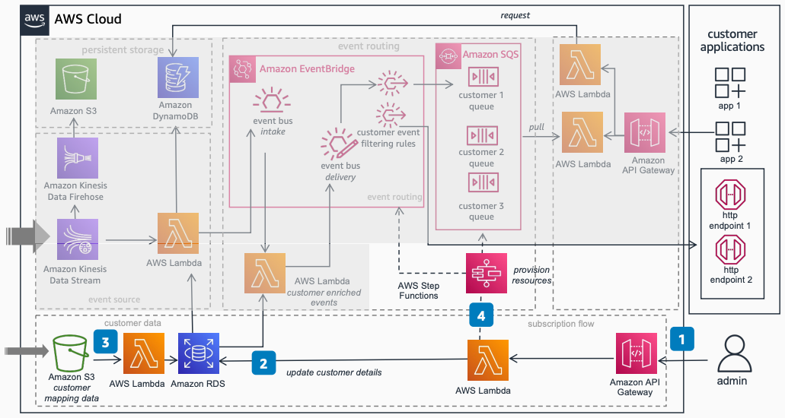

# Provide DaaS to Fleet Customers: Subscription flow

Publication date: **February 16, 2023 ([Diagram history](#daas-sub-history "#daas-sub-history"))**

With this architecture, you can onboard new fleet customers requesting data
subscriptions. Manage subscriptions for specific vehicle data packages such as alerts,
telematics, and diagnostics. The solution uses [Amazon API Gateway](../../../apigateway/latest/developerguide.md "../../../apigateway/latest/developerguide.md") for the subscription API, [AWS Lambda](../../../lambda/latest/dg.md "../../../lambda/latest/dg.md") for processing, and [AWS Step Functions](../../../step-functions/latest/dg/welcome.md "../../../step-functions/latest/dg/welcome.md") for resource
provisioning.

## DaaS subscription flow diagram

The following steps describe the subscription onboarding workflow for this
architecture:

1. Invoke the Subscription API through Amazon API Gateway to onboard new customers. Request
   subscriptions for specific vehicle data packages (such as VIN, Customer ID, alerts, or
   telematics data).
2. Store customer data subscription request details in the [Amazon RDS](../../../AmazonRDS/latest/UserGuide.md "../../../AmazonRDS/latest/UserGuide.md") database by using Lambda.
3. Upload or update bulk reference data (such as customer-to-vehicle VIN mapping) into
   an [Amazon Simple Storage Service](../../../AmazonS3/latest/userguide.md "../../../AmazonS3/latest/userguide.md") bucket.
   Load the data into the database with Lambda.
4. Invoke a workflow to provision customer-specific AWS resources with AWS Step Functions.
   Create resources such as customer-specific [Amazon SQS](../../../AWSSimpleQueueService/latest/SQSDeveloperGuide.md "../../../AWSSimpleQueueService/latest/SQSDeveloperGuide.md") queues or [Amazon EventBridge](../../../eventbridge/latest/userguide.md "../../../eventbridge/latest/userguide.md")
   rules.

## Further reading

For additional information, see the following resources:

- [AWS Architecture Icons](https://aws.amazon.com/architecture/icons "https://aws.amazon.com/architecture/icons")
- [AWS Architecture Center](https://aws.amazon.com/architecture/ "https://aws.amazon.com/architecture/")
- [AWS
  Well-Architected](https://aws.amazon.com/architecture/well-architected "https://aws.amazon.com/architecture/well-architected")

## Diagram history

To receive updates about this reference architecture diagram, subscribe to the RSS
feed.

| Change                                                                                                           | Description                                     | Date              |
| ---------------------------------------------------------------------------------------------------------------- | ----------------------------------------------- | ----------------- |
| [Initial publication](provide-daas-data-flow.md#daas-flow-history "provide-daas-data-flow.md#daas-flow-history") | Reference architecture diagram first published. | February 16, 2023 |
| Initial publication                                                                                              | Reference architecture diagram first published. | February 16, 2023 |

###### RSS subscription requirement

To subscribe to RSS updates, you must have an RSS plugin enabled for the browser you are
using.
