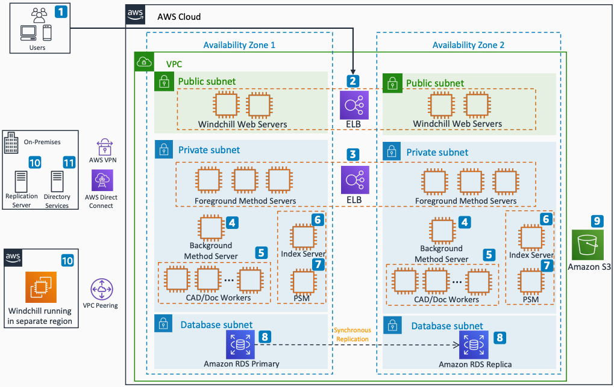

# PTC Windchill Product Lifecycle Management on AWS

Publication date: **2020 ([Diagram history](#ptcw-diagram-history "#ptcw-diagram-history"))**

With this architecture, you can deploy a highly available, load-balanced configuration
of PTC Windchill on AWS that automatically scales on demand. This
architecture uses [Amazon Elastic Compute Cloud](../../../AWSEC2/latest/UserGuide.md "../../../AWSEC2/latest/UserGuide.md") (Amazon EC2), [Elastic Load Balancing](../../../elasticloadbalancing/latest/userguide.md "../../../elasticloadbalancing/latest/userguide.md"), [Amazon S3](../../../AmazonS3/latest/userguide.md "../../../AmazonS3/latest/userguide.md"), and [Amazon Relational Database Service](../../../AmazonRDS/latest/UserGuide.md "../../../AmazonRDS/latest/UserGuide.md") (Amazon RDS).

## PTC Windchill PLM architecture diagram

The following steps describe the architecture:

1. Users connect to the system through a web browser, Office apps, a
   computer-aided design (CAD) tool, or mobile devices.
2. Elastic Load Balancing directs user traffic to the Windchill web servers based on
   application availability on each node.
3. Elastic Load Balancing directs traffic to the Method Servers for client transactions and
   interactions with other systems.
4. A Background Server running on an Amazon EC2 instance performs dynamic content
   generation for end users or backend systems.
5. The Windchill cluster uses CAD/Doc Workers to create PDF versions
   of CAD and Office content and stores them in Amazon S3.
6. A Solr Index Server on Amazon EC2 supports keyword searches, including
   searching across metadata stored in the database.
7. Use PTC Solution Monitor (PSM) as a real-time performance
   monitoring tool for the system, application, and database.
8. Amazon RDS stores metadata for the application. Configure Amazon RDS with synchronous
   replication across Availability Zones.
9. The Windchill application uses Amazon S3 file storage to store content
   files.
10. Windchill replicates content for user collaboration through the
    Replication Server across Windchill workloads by using Amazon VPC
    peering.
11. Integrate corporate LDAP for both authentication and account management for
    Windchill by using [AWS Directory Service](../../../directoryservice/latest/admin-guide.md "../../../directoryservice/latest/admin-guide.md").
    Windchill can run in a separate Region.

## Further reading

For additional information, see the following resources:

- [AWS Architecture Icons](https://aws.amazon.com/architecture/icons "https://aws.amazon.com/architecture/icons")
- [AWS Architecture Center](https://aws.amazon.com/architecture "https://aws.amazon.com/architecture")
- [AWS Well-Architected](https://aws.amazon.com/architecture/well-architected "https://aws.amazon.com/architecture/well-architected")

## Diagram history

To be notified about updates to this reference architecture diagram, subscribe to the RSS feed.

| Change              | Description                                     | Date            |
| ------------------- | ----------------------------------------------- | --------------- |
| Initial publication | Reference architecture diagram first published. | January 1, 2020 |

###### RSS subscription

To subscribe to RSS updates, you must have an RSS plugin enabled for the browser that you are using.
