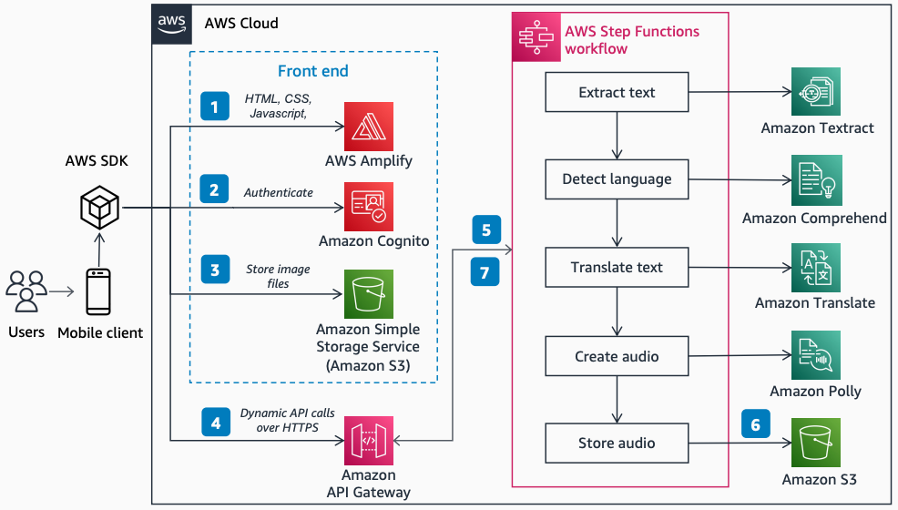

# ReadForMe

Publication date: **January 25, 2022 ([Diagram history](#diagram-history "#diagram-history"))**

This architecture shows how the ReadForMe web app uses the AWS Cloud to assist the visually impaired with hearing paper documents. With an event-driven serverless architecture and AI services, you can convert images of text into audio output.

## ReadForMe

The following steps describe the architecture:

1. [AWS Amplify](../../../amplify/latest/userguide/welcome.md "../../../amplify/latest/userguide/welcome.md") distributes the ReadForMe web app (HTML, JavaScript, and CSS) to end users' mobile devices.
2. The [Amazon Cognito](../../../cognito/latest/developerguide/what-is-amazon-cognito.md "../../../cognito/latest/developerguide/what-is-amazon-cognito.md") identity pool grants temporary access to the [Amazon Simple Storage Service](../../../AmazonS3/latest/userguide/Welcome.md "../../../AmazonS3/latest/userguide/Welcome.md") bucket.
3. The user uploads an image file to the Amazon S3 bucket by using the AWS SDK through the web app.
4. The ReadForMe web app invokes the backend AI services by sending the Amazon S3 object key in the payload to [Amazon API Gateway](../../../apigateway/latest/developerguide/welcome.md "../../../apigateway/latest/developerguide/welcome.md").
5. API Gateway instantiates an [AWS Step Functions](../../../step-functions/latest/dg/welcome.md "../../../step-functions/latest/dg/welcome.md") workflow. The state machine orchestrates [Amazon Textract](../../../textract/latest/dg/what-is.md "../../../textract/latest/dg/what-is.md"), [Amazon Comprehend](../../../comprehend/latest/dg/what-is.md "../../../comprehend/latest/dg/what-is.md"), [Amazon Translate](../../../translate/latest/dg/what-is.md "../../../translate/latest/dg/what-is.md"), and [Amazon Polly](../../../polly/latest/dg/what-is.md "../../../polly/latest/dg/what-is.md") by using [AWS Lambda](../../../lambda/latest/dg/welcome.md "../../../lambda/latest/dg/welcome.md") functions.
6. The Step Functions workflow creates an audio file as output and stores it in Amazon S3 in MP3 format.
7. A pre-signed URL with the location of the audio file is sent back to the user's browser through API Gateway. The user's mobile device plays the audio file.

## Further reading

For additional information, refer to the following resources:

- [AWS Architecture Icons](https://aws.amazon.com/architecture/icons "https://aws.amazon.com/architecture/icons")
- [AWS Architecture Center](https://aws.amazon.com/architecture "https://aws.amazon.com/architecture")
- [AWS Well-Architected](https://aws.amazon.com/architecture/well-architected "https://aws.amazon.com/architecture/well-architected")
- [AWS Amplify product page](https://aws.amazon.com/amplify/ "https://aws.amazon.com/amplify/")

## Diagram history

To be notified about updates to this reference architecture diagram, subscribe to the RSS feed.

| Change              | Description                                     | Date             |
| ------------------- | ----------------------------------------------- | ---------------- |
| Initial publication | Reference architecture diagram first published. | January 25, 2022 |

###### Note

To subscribe to RSS updates, you must have an RSS plugin enabled for the browser you are using.
